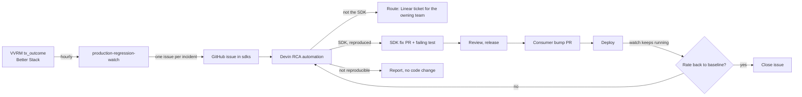

# Production observability for SDK-generated transactions

How the SDK team learns that SDK-generated transactions fail in production, finds the layer at
fault, fixes the SDK when it is at fault, and checks in production that the fix worked
([SDK-1351](https://linear.app/morpho-labs/issue/SDK-1351)). VVRM is the first consumer; other apps
join by configuration.

## The loop



| Step | Owner | State |
| -- | -- | -- |
| Detection | `production-regression-watch` workflow | Shipped in #1264 (off until secrets exist) |
| Incident issue with evidence and SDK versions | same | Shipped in #1264 |
| RCA, attribution, routing | Devin Automation on the issue | Prompt below; created after merge |
| SDK fix | RCA session, SDK PR flow | Existing PR, review and changeset flow |
| Release | `publish.yml` | Existing |
| Release integrity | `npm-release-watch` + release verifier (SDK-1264) | Existing |
| Consumer bump | RCA session, version-only PR in the consumer | Manual trigger in phase 2 |
| Production verification | the watch itself, plus the RCA session re-checking the issue's query | Phase 2 |

## Telemetry used

The watch reads the metrics VVRM already sends. No VVRM change is needed for the MVP.

| Field | Source | Use |
| -- | -- | -- |
| `metadata_event = 'tx_outcome'` | `/api/t/transaction` | one row per transaction attempt |
| `action_type`, `chain_id` | same | grouping key (action × chain) |
| `outcome`, `error_category` | same | the three signals below |
| `bypassed_simulation_failure` | same | successes that a simulation failure did not block |
| `tx_release` | Vercel commit SHA on every server log | release correlation; logged since 2026-09-30 |
| SDK versions | the consumer's `package.json` at `tx_release` | read from GitHub, never guessed |

### Signals

Each signal has its own rate. They are never summed into one failure rate.

| Signal | Failures | Attempts | Matches dashboard panel |
| -- | -- | -- | -- |
| `simulation_failure` | `simulation_failed` failures minus bypassed ones | successes + `tx_failure` failures + those simulation failures (a bypassed failure counts once, as a success) | Simulation failure rate |
| `tx_failure` | failures except `simulation_failed`, `safe_proposal_pending`, `timeout_receipt_polling`, including failures with no `error_category` | successes + those failures | TX success rate, Flow×chain error rate |
| `onchain_revert` | `transaction_reverted_onchain` | same as `tx_failure` | — (subset of `tx_failure`) |

`user_rejected` is not a failure. `signature` is out of both signals and `approval_tx` is out of the
simulation signal, as on the dashboard. The dashboard's exclusions of `aaveV3MigrateToVaultV2`,
`unknown`, empty actions and the 2026-09-29 `wrapLegacyMorpho` incident are part of the consumer
config.

RPC health (`rpc_usage`) stays on its own dashboard panel. The RCA reads it to rule RPC in or out; it
does not open incidents by itself.

### Gaps

| Gap | Effect | Smallest addition |
| -- | -- | -- |
| No SDK-side event: the SDK does not know which entity or action built a transaction | attribution goes through VVRM's `action_type` | an `sdk_action` label (`<package>/<entity>.<action>`) set by the consumer from the SDK's action name |
| No revert reason or selector on `transaction_reverted_onchain` | RCA must fetch the tx to see why | a `revert_selector` label (4 bytes) on reverted outcomes |
| No tx hash in metrics, only in logs | RCA joins logs to metrics by `attempt_id` | none; document the join |
| `tx_release` only since 2026-09-30 | release correlation is blind before that date | none |
| Daily forensic pass | slow or rare failures under the hourly floors | phase 2: same detector, 7-day current window, 28-day baseline |

## Detection

For each signal and each action × chain pair, the watch compares the last 24 hours with the 7 days
before. A pair becomes a regression only when all of these hold:

| Floor | Default | Why |
| -- | -- | -- |
| current attempts | ≥ 20 | enough volume to mean anything |
| current failures | ≥ 5 | a handful of users, not one |
| baseline attempts | ≥ 30, else the action's baseline across all chains | new pairs still get a reference |
| rate increase | ≥ 5 points | ignore small drifts |
| rate ratio | ≥ 2× | ignore pairs that are always noisy |
| one-sided two-proportion z | ≥ 4 | statistical evidence; the hourly run repeats the test, so the bar is high |

Severity is impact only: `high` at ≥ 25 excess failures, or a rate ≥ 50% with ≥ 10 failures;
`medium` at ≥ 10 excess failures; `low` otherwise. Only `medium` and above open issues. `critical` is never
set by the detector: the RCA raises an incident to critical when it finds a fund-loss path (wrong
spender, receiver or amount, replayable permit or signature, missing slippage bound).

Regressions of one signal on one chain become one incident, because actions failing together on a
chain usually share a cause. The incident title is the deduplication key: the watch skips titles
with an open issue or one closed less than 48 hours ago, and logs `already tracked: <title>`. New
evidence on a tracked incident (more actions, higher severity) is not posted to the open issue yet.

A release is marked "new" when it first appears inside the current window. An incident is
release-correlated when new releases account for at least 20 points more of the failures than of the
attempts.

### Backtest

Replaying the detector at midnight UTC for each of the 21 days up to 2026-10-03:

> This replay used the first revision of the query. Failures with no `error_category` now count as
> `tx_failure`, and releases that are not commit SHAs read as not logged. Re-run the replay before
> retuning thresholds.

| Day | Incidents that would have opened |
| -- | -- |
| 09-13 → 09-21, 09-23, 09-24, 09-28, 10-02, 10-03 | none |
| 09-22 | `tx_failure` Base: `VaultV2_Withdraw` |
| 09-25 | `tx_failure` Ethereum: `VaultV2_Withdraw` |
| 09-26 | `simulation_failure` Ethereum: `borrow` |
| 09-27 | `tx_failure` Ethereum: `approval_tx` |
| 09-29 | `simulation_failure` Base: 3 actions; `tx_failure` Base: `approval_tx` |
| 09-30 | `simulation_failure` Base (5 actions), Ethereum (3), Arc (1); `tx_failure` Monad (143): `approval_tx` |
| 10-01 | `simulation_failure` Arc: `borrow`, `supplyCollateralBorrow` (98% failing); Ethereum (3 actions) |

09-29 → 10-01 is the multi-chain simulation incident and the Arc `borrow` breakage. The single-pair
`tx_failure` days are the expected noise: around one issue every few days, each closed by the RCA
if it finds nothing.

## Root cause analysis

The RCA runs as a Devin Automation triggered by issues titled `production regression:` opened by
`github-actions[bot]` in `morpho-org/sdks`. It never changes code that is not in this repository.

Attribution, checked in this order. Each verdict states its evidence and a confidence (`high` when
reproduced or proven by a diff, `medium` when the evidence points one way without a repro, `low`
otherwise):

| Layer | Evidence that points to it | Action |
| -- | -- | -- |
| Chain or protocol | same failure across apps and wallets, on-chain state change (paused market, cap reached, oracle) | Linear ticket to the protocol or integrations team |
| RPC or simulation backend | matching rise in `rpc_usage` errors or simulation provider errors, all actions on one chain | ticket to the VVRM team (infra) |
| Wallet | concentrated on one `wallet_type` | ticket to the VVRM team |
| VVRM product logic | correlated with a VVRM release that did not change SDK versions | ticket to the VVRM team with the release diff |
| SDK | correlated with a VVRM release that changed SDK versions, or calldata built by the SDK is wrong for the inputs | SDK fix flow below |

SDK fix flow:

1. Search open SDK issues and PRs, and Linear, for the same cause. Comment there instead of
   duplicating.
2. Reproduce with a failing fork test in the owning package (`packages/*/test`), pinned to a block
   inside the incident window.
3. If no deterministic failing test exists, stop. Comment the evidence and mark the issue
   `needs-human`. No speculative fix.
4. Otherwise open the smallest fix as a draft PR with the test and a changeset, linked to the issue,
   and follow the normal review flow. Nothing is auto-merged.
5. After release, open a version-only bump PR in each consumer whose deployed release uses an
   affected version. Draft, normal review.
6. After the consumer deploys, the watch keeps running. Close the issue once 24 hours after deploy
   pass with the pair below its floors. If the regression is still there, re-open the RCA.

Notifications go to `#sdks-automations`: one message per incident at `high`, and when an SDK fix PR
is opened.

### RCA automation prompt

```text
You are the SDK production-regression investigator. Input: a GitHub issue in morpho-org/sdks titled
"production regression: …", opened by github-actions[bot]. Its body has a summary table and a JSON
evidence block (consumer, signal, chain, action rows, releases with SDK versions).

Never downgrade an error, empty response or failed command into "no issue found".

1. Query Better Stack source vvrm-app-vercel-otel (metrics and logs) for the incident window:
   error_category, error_name, error_message, wallet_type and release split for each action row;
   rpc_usage errors on the same chain; the same pair over the last 24h to see if it is still
   ongoing.
2. Attribute the regression to one layer: chain/protocol, RPC/simulation backend, wallet, VVRM
   product logic, or SDK. Use the attribution table in docs/production-observability.md. State
   evidence and confidence.
3. If the layer is not the SDK: search Linear for an existing ticket and comment there, or file
   one for the owning team. Comment on this issue with the verdict and the link. Do not change any
   code.
4. If the layer is the SDK: follow "SDK fix flow" in docs/production-observability.md. A fix needs a
   deterministic failing test first; without one, comment the evidence and add the needs-human
   label.
5. Raise the severity to critical only if you found a fund-loss path, and say which one.
6. Post a one-line summary to #sdks-automations for high or critical incidents.
```

## Adding a consumer

Add an entry to `CONSUMERS` in `scripts/observability/tx-health.ts` with its repository, manifest
path, Better Stack metrics collection, dashboard and exclusions. The consumer must emit
`tx_outcome` with `action_type`, `chain_id`, `outcome`, `error_category` and `tx_release`, and its
collection must be readable by the SQL credentials.

## Enabling the watch

1. Create the GitHub environment `production-regression-watch` with a deployment-branch policy
   that allows only `main`. All the secrets below are environment secrets, so a workflow run from
   another branch cannot read them.
2. Create a Better Stack connection with read access to the VVRM source, then store
   `BETTERSTACK_SQL_URL`, `BETTERSTACK_SQL_USERNAME` and `BETTERSTACK_SQL_PASSWORD` in that
   environment.
3. Store `CONSUMER_REPOSITORY_TOKEN` there too: a fine-grained token with `contents: read` on
   `morpho-org/morpho-apps`. Without it the issues say the SDK versions are unresolved.
4. Set the repository variable `PRODUCTION_REGRESSION_WATCH_ENABLED` to `true`, then run the
   workflow once by hand from `main` to check it. The variable gates manual runs too.

Locally, `node scripts/observability/watch-production-regressions.ts --dry-run --input rows.ndjson
--now <ISO time>` prints the issues it would open from a saved query result. `--input` holds one
consumer's rows, so it only works while `CONSUMERS` has a single entry.

Telemetry labels are client-reported. Rows whose `action_type` or `chain_id` is not a plain
identifier are dropped and counted in the run log, and a `tx_release` that is not a commit SHA is
treated as not logged, so forged labels cannot reach the issue text.

## Phases

| Phase | Scope |
| -- | -- |
| 1 (#1264) | Hourly detector, incident issues, design, RCA prompt |
| 2 | Enable secrets; create the RCA automation; daily forensic window; production verification comment on close |
| 3 | `sdk_action` and `revert_selector` labels in VVRM; second consumer |

## Risks and unknowns

- Multi-chain simulation incidents (as on 09-30) open several issues, one per chain. The RCA should
  link them rather than investigate each.
- Thresholds come from three weeks of traffic; low-volume chains rarely reach the floors and are
  covered only by the action-wide fallback.
- The SQL API URL is regional; check it against the Better Stack connection when creating it.
