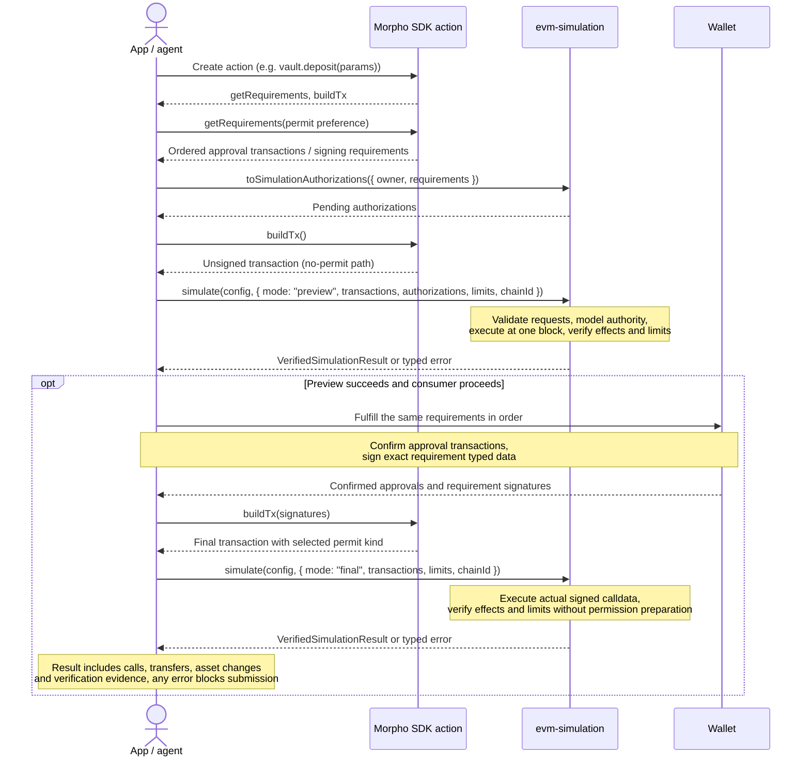

# TIB-2026-09-18: EVM simulation — calldata verification and result constraints

| Field | Value |
| --- | --- |
| **Date** | 2026-09-18; revised 2026-09-24 |
| **Author** | @foulques, @jinmel |
| **Scope** | `evm-simulation` 5.0.0, under the approved 2026-09-24 lifecycle exception; consumers: Vaults frontend and write API |
| **SDK baseline** | `morpho-sdk` **6.0.0**, released 2026-09-24; pinned version for routes, ABIs, addresses and behavior |

## Context and decision

The Vaults frontend and independent write API need the same answer: does this transaction execute,
produce the intended Morpho effects, and satisfy the user's constraints? Asset changes alone cannot
prove that a deposit credited the right position, a repayment reduced debt, or a permission is safe.

An integration goal is to preserve the usual SDK action-creation flow (`getRequirements()` and
`buildTx()`) and connect its outputs directly to `simulate()`. Agents should reuse the action's
transactions and requirements with minimal glue code, without duplicating permit selection,
authorization payloads or operation descriptions for simulation.

Keep `simulate(config, params)` and extend its existing public interface below. Decode operations
from calldata, verify their effects, and apply typed simulation limits. Use `eth_simulateV1` only;
remove Tenderly and provider fallback. Every verification failure blocks acceptance.

Support the released v6 routes: `BlueBundlesV1` for Blue actions and full-position refinance,
`VaultBundlesV1` for Vault V1/V2 deposits and exits and V1 → V2 migration, and
`VaultExitBundlesV1` for in-kind redemption and V2 force withdrawal. Supported direct operations
include Morpho authorization, pre-liquidation authorization and the SDK's V2 force-redemption recipe.
Reject legacy Bundler3 routes, arbitrary call composition, partial refinance and Midnight operations.

## Verification contract

- Verify wallet debits, receipts and refunds; position and market accounting; vault shares and
  allocations; permissions; fees and penalties; liquidity, slippage and liquidation risk.
- Bind every effect to the decoded chain, deployment, owner, recipient, token, market and adapter.
  Full closes must close the selected position; partial actions must preserve the correct remainder.
- Distinguish action effects from interest accrual. Reconcile native and ERC-20 funding without double
  counting, use real native balances, and reject unexplained changes or retained bundle funds.
- Resolve one block for execution and verification. Missing evidence or unsupported behavior fails
  explicitly; a partial check never counts as successful verification.

### Preview and final

`preview` checks the SDK's no-signature transaction and the exact pending wallet requests. It may
prepare only the requested authority, reports preparation separately, and verifies that authority
before evaluating the transaction. It does not prove that a signature will execute.

`final` executes signed calldata against actual permissions, accepts no pending `authorizations`,
and uses no synthetic permission preparation. Both modes enforce the same effect checks and limits.
The write API uses `preview`; the frontend independently previews, checks wallet requests and runs
`final` before submission. A successful preview cannot replace final simulation.

## Public Interface

`simulate(config, params)` keeps `config.chains`, `simulateV1Url`, `logger`, `timeoutMs`, and every
existing `SimulateParams` field. `simulateV1Url` becomes required per chain. Two optional fields are
added and `authorizations` is retyped.

| Input | Contents |
| --- | --- |
| `chainId`, `transactions` | Ordered `{ from, to, data, value? }`; protected user = common `from`. No intent input |
| `authorizations?` (retyped) | `readonly SimulationAuthorization[]`, one entry per wallet request the user has not yet completed; `preview` only |
| `blockNumber?` | `bigint` or block tag; resolved once, `latest` by default |
| `mode?` (new) | `"final"` (default) or `"preview"` |
| `limits?` (new) | `SimulationLimits` below; omitted values use SDK defaults |

### `SimulationAuthorization`

A discriminated union of wallet requests. Every variant names the owner; the owner must equal the
transactions' common `from`. Typed-data variants carry the exact EIP-712 payload
(`{ domain, types, primaryType, message }`) the wallet will be shown, so the SDK verifies what is
signed, not a summary of it.

| Variant `type` | Wallet action | Fields |
| --- | --- | --- |
| `"erc20Approval"` | Sends `approve(spender, amount)` on `token` | `token`, `owner`, `spender`, `amount` |
| `"erc2612Permit"` | Signs `Permit` typed data on an ERC-20 or a Vault V1/V2 share token | `typedData` with `primaryType: "Permit"`; `domain.verifyingContract` is the token |
| `"permit2SignatureTransfer"` | Signs a one-time Permit2 transfer | `owner`, `typedData` with `primaryType: "PermitTransferFrom"`; `domain.verifyingContract` is the chain's Permit2 |
| `"blueAuthorization"` | Sends `Morpho.setAuthorization(authorized, isAuthorized)` | `authorizer`, `authorized`, `isAuthorized` |
| `"blueAuthorizationSignature"` | Signs Morpho `Authorization` typed data consumed by `setAuthorizationWithSig` | `typedData` with `primaryType: "Authorization"`; `domain.verifyingContract` is the chain's Morpho |

Permit2 SignatureTransfer does not include the owner in its signed message; its explicit `owner`
field binds the request to the protected sender. Permit2 AllowanceTransfer (`PermitSingle`) is not
supported by the migrated routes.

The legacy `approval` and `signature` variants are removed in the major (see Migration).

### `SimulationLimits`

Consumers may only tighten. Every ratio is a WAD-scaled `bigint`; every amount is a raw `bigint` in
the token's or share's smallest unit; every address is an `Address`; every market is a `MarketId`.
Bounds are inclusive. There is no free-form metric, subject or time-basis field.

| Field | Meaning / default |
| --- | --- |
| `maxSlippageWad?` | Conversion slippage bound; default `DEFAULT_SLIPPAGE_TOLERANCE` (`3_00000000000000n`, 0.03%) |
| `minLltvBufferWad?` | Distance below LLTV (or active `preLltv`) a risk-increasing action must keep; default `DEFAULT_LLTV_BUFFER` (`WAD / 200n`, 0.5%) |
| `maxSignatureLifetimeSeconds?` | Upper bound on `deadline − blockTimestamp` for every typed-data request; default `7_200n` |
| `wallet?` | `{ maxDebit?: TokenAmount[], minCredit?: TokenAmount[] }` where `TokenAmount = { token, amount }` and native uses viem's `ethAddress` |
| `operations?` | `readonly OperationLimit[]`; see [appendix](#operation-limits) |

### Output

`VerifiedSimulationResult extends SimulationResult` preserves `simulationTxs`, `calls`, `transfers`
and `assetChanges`. `simulationTxs` equals the caller's `transactions`; all user transaction indices
remain unchanged.

The added `verification` field contains:

- `mode`, `chainId`, `blockNumber`, `blockTimestamp`, effective `limits` and decoded `operations`.
- One record per authorization request, indexed by `authorizationIndex`: the request, preparation,
  request checks and read-back evidence. Preparation remains a discriminated record:
  `approvalCalls` with ordered `{ from, to, data, value }` calls and results/logs, or `stateOverride`
  with `{ address, storageVariable, slot, value }`.
- `before`, `after`, `diff` and `actionDiff` for wallet balances, permissions, positions, vaults and
  markets, plus conversions and fees. Only `actionDiff` excludes modeled accrual; unchanged values
  are included.

### Errors

Preserve `SimulationPackageError` and existing error names, codes, constructors, fields and
`instanceof` behavior. Additions extend the base directly. See the [error catalog](#error-catalog)
in the appendix for classes, codes and failure conditions.

Errors preserve `txIdx`, `fieldErrors`, `reason`, `details` and retention's
`{ address, token, netRetained }` string amounts. Readonly context identifies the mode, stage, chain,
block, operation, transaction or authorization, affected subject, and expected/observed values with
units, where available. Consumers branch on class or code; messages explain the failure and remedy.
Do not expose signatures, credentials or raw causes in consumer-facing output.

## Morpho-specific failure messages

Execution errors must explain **which Morpho operation failed, what contract condition caused it,
and what the user can change**. A raw revert selector or “simulation failed” is insufficient for a
known failure. Include the affected market or vault and relevant amounts when available; do not
invent a cause or remediation when the evidence is incomplete.

Maintain complete coverage of every documented contract failure reachable through supported v6
routes, including nested token, permit, bundle, vault and adapter calls. The implementation must
inventory the pinned contracts' documented errors and revert conditions, map each reachable case
to its typed error and Morpho-context message, and test that mapping. Any unreachable documented
case needs an explicit scope rationale. ABI custom errors alone are not a complete inventory.

Examples of the required message quality:

| Failure | Message content |
| --- | --- |
| Insufficient market liquidity | Borrow or withdrawal failed; identify the market, requested amount and available liquidity; suggest reducing the amount or adding liquidity. |
| Unsafe collateral withdrawal | Identify the market and the health condition that prevented withdrawal; suggest repaying debt or withdrawing less collateral. |
| Missing authority | Identify the token/spender or Morpho operator required by the operation; explain the approval or authorization needed. |
| Expired permit or consumed nonce | Identify the failed authorization and request a fresh signature. |
| Vault or adapter restriction | Identify the vault/adapter and the documented cap, liquidity, access or exit condition that rejected the operation. |

These examples do not limit coverage. Unknown reverts retain their execution-failure classification
and available diagnostic context without being mislabeled as a known Morpho condition. Transport
failures and missing verification evidence remain separate from contract execution failures.

## Simulation limits are result constraints

Limits define which decoded parameters and verified outcomes the consumer will accept. A transaction
can execute successfully and still fail these constraints. Such a failure must never be reported as
`SimulationRevertedError`.

- Intersect SDK, calldata and consumer bounds. Consumers may tighten protections; they cannot weaken
  them. Omitted limits retain SDK defaults.
- Bind each operation limit to exactly one decoded operation using its subject and, when needed,
  `transactionIndex`. Unknown, ambiguous, inapplicable or widening limits are validation errors.
- Compare `expected*` pins with calldata or entrypoint-defined bindings. Compare outcome bounds with
  verified state or action effects; wallet limits apply to net balances, excluding gas.
- Risk-increasing actions must respect the LLTV or active pre-liquidation threshold minus the buffer.
  Repayments and collateral top-ups may leave a position unhealthy if they do not worsen risk.
- Report a consumer constraint breach as `ConsumerLimitViolationError`, with the violated field,
  subject, bound and observed value in its fixed unit. Preserve `MarketConstraintViolationError`
  and `SlippageLimitExceededError` for their SDK policy checks.

For example, a successful borrow that leaves LTV above `maxLtvAfterWad` is a consumer limit violation.
A borrow rejected by the contract is an execution failure. A correct exit penalty above the consumer's
cap is a limit violation; an incorrectly charged penalty is `FeeMismatchError`. A contract-enforced
slippage bound that reverts is an execution failure; a successful conversion outside a verification
bound is a constraint violation.

# Proposed design

Use the SDK action's `getRequirements()` as the single source of truth for permit selection and
pending simulation authorizations. The simulator independently checks those requests against
calldata and state.

### Vault bundle permit selection

Resolve requirements using the caller's signature capabilities and permit preference:

| Funding path | Selection |
| --- | --- |
| Native deposit | No token authorization |
| ERC-20 deposit, signatures disabled | Direct approval to the vault bundle, unless existing allowance suffices |
| ERC-20 deposit, simple permit requested and supported | ERC-2612 permit |
| Otherwise, signatures enabled and Permit2 available | Permit2 SignatureTransfer, plus approval to canonical Permit2 if needed |
| Neither signature path available | Direct approval |
| Vault-share exit | Route-supported ERC-2612 or direct approval; no Permit2 |

For VaultBundlesV1 exits, the share allowance is the burn cap: an exact allowance needs no request;
an insufficient allowance may be raised by permit; an oversized allowance must be reduced through
an approval transaction. Other exit routes retain their own allowance rules.

The final builder derives the encoded permit kind from the supplied requirement signature. Without
a signature, it uses the no-permit path. Consumers do not select the encoded kind independently.

### Deriving simulation authorizations

Add a pure adapter in `evm-simulation`, provisionally
`toSimulationAuthorizations({ owner, requirements }): readonly SimulationAuthorization[]`.
It converts pending action requirements into the existing authorization union:

| SDK requirement | Simulation authorization |
| --- | --- |
| ERC-20 approval transaction | `erc20Approval`, decoded from the transaction |
| `permit` signature requirement | `erc2612Permit`, preserving exact `action.typedData` |
| `permit2SignatureTransfer` signature requirement | `permit2SignatureTransfer`, preserving typed data and binding `owner` |
| Morpho authorization transaction | `blueAuthorization`, decoded from the transaction |
| `authorization` signature requirement | `blueAuthorizationSignature`, preserving exact `action.typedData` |

Preserve request order, including zero-reset approvals. Never widen amounts, invent approvals or
reconstruct typed data from summaries. Unsupported requirements fail explicitly. Conversion creates
descriptors; it does not establish that the requests are safe for the decoded operation.

### Consumer flow

1. Create the vault action and resolve its requirements.
2. Convert pending requirements into authorizations and preview the no-signature `buildTx()` output.
3. Fulfill those same wallet requests, then pass their signatures to `buildTx(signatures)`.
4. After prerequisite approvals are confirmed, run `final` with no pending `authorizations`.

A Permit2 deposit may require both approval **to Permit2** and a transfer signature naming
**VaultBundlesV1 as spender**. Preserve both requests. If the permit preference changes or a
nonce/deadline becomes stale, regenerate requirements and preview again before signing. No shared
mutable state connects preparation, signing and transaction building.

### Permit2 preview compatibility

The unsigned `buildTx()` encodes `PermitKind.None` and pulls tokens directly through the vault
bundle. Approval to canonical Permit2 alone cannot fund this path. For each validated
`permit2SignatureTransfer` request, preview must simulate an exact token approval from `owner` to
the signed bundle `spender` for `message.permitted.amount`, then read back the allowance before
executing the unchanged unsigned transaction. Record this as preparation for that request, never
as an additional wallet request. Supported tokens requiring a zero reset need recorded reset/grant
preparation; unsupported approval behavior fails explicitly.

Separately verify that the real token allowance to canonical Permit2 covers the final transfer,
or that a supplied approval request provides it. Validate the signed domain, owner, token, spender,
gross amount, deadline and unused nonce bit. A missing Permit2 approval must fail even if the
simulated direct allowance would let preview execute.

Preview neither consumes nor overrides the Permit2 nonce and never inserts a dummy signature.
Permission checks must distinguish modeled direct allowance consumption from final Permit2 nonce
consumption; preview does not prove that the signed transfer will execute. Final uses the real
Permit2 signature and verifies its execution and nonce consumption. Reject signature-consuming
calldata in preview instead of attempting to bypass signature verification.

## Migration

On 2026-09-24 the user approved a one-time exception to the prior successor-introduction,
`@deprecated`, and published deprecation-minor/coexistence steps. `evm-simulation` 5.0.0 may
remove only `TenderlyRpcConfig`, `ChainSimulationConfig.tenderlyRpc`, Tenderly/provider-fallback
behavior, and the legacy `approval` / `signature` `SimulationAuthorization` variants without
that minor. SDK-1291 retires Tenderly; SDK-1293 replaces the authorization variants. No other
API removal inherits this exception. Root `AGENTS.md` §7 and the `module-api-architecture`
review persona codify the same scope.

The major changeset, migration guide, maintained-dependent/runtime/peer audit and any required
bumps, Cantina major audit with its public report linked from the release CHANGELOG, and
continued availability of the previous major remain mandatory. Work stays on the unreleased
v5 integration branch until SDK-1297 promotes the complete stack; publication is SDK-556.
See the [v4 → v5 migration guide](../migrations/evm-simulation-v4-to-v5.md).

Provide a migration guide for these changes, update `packages/evm-simulation/AGENTS.md` to match,
and remove consumer error bypasses. Consumers must distinguish execution failures, verification
failures and constraint violations while blocking acceptance on all three.

## Acceptance criteria

- [ ] Pinned-block contract tests cover every supported v6 operation and its asset, permission,
      position, market, fee and safety checks in both modes.
- [ ] Every documented contract failure reachable through those routes has a tested typed mapping
      and meaningful Morpho-context message; excluded cases have a scope rationale.
- [ ] Every limit field has enforcement coverage, including successful execution that violates a
      constraint, invalid limit bindings, and attempts to weaken SDK defaults.
- [ ] Preview validates exact wallet requests without widening authority; final verifies real signed
      execution. Preparation never changes public transaction indices or hides unrelated effects.
- [ ] Permit2 fork tests cover zero initial bundle allowance, existing or pending approval to Permit2,
      missing Permit2 approval, stale/reused nonces, wrong spender or amount, reset-required tokens,
      and rejection of signature-consuming preview calldata. Preview leaves the nonce unchanged;
      successful final execution consumes it. Invalid signatures fail in final.
- [ ] Missing evidence, unsupported routes and unknown failures fail explicitly. Existing error
      compatibility is preserved, and consumers block every failure category.
- [ ] Repeated inputs at the same pinned block produce identical verification output; migration
      documentation and package rules match the shipped interface.

## References

- [SDK v5 → v6 migration guide](https://github.com/morpho-org/sdks/blob/9e0aedeabe9e6b7e9925d21a2c8a5d05dd2690e1/packages/morpho-sdk/MIGRATION-v5-to-v6.md)
- [BlueBundlesV1 route decision](./TIB-2026-08-25-blue-bundles-v1-sdk-actions.md)
- [Vault exit in-kind redemption](./TIB-2026-07-27-vault-exit-in-kind-redemption.md)

## Appendix

### Operation limits

A discriminated union keyed by the decoded operation `type`. The discriminators reuse the
`morpho-sdk` `TransactionAction` names where one exists. Each variant carries **subject** fields that
bind it to exactly one decoded operation, optional **`expected*` pins** compared to the
decoded calldata parameter or the entrypoint-defined sender binding, and optional **outcome bounds** on verified before/after state. Field
suffixes fix the unit: `*Assets` and `*Shares` are raw amounts, `*Wad` is a WAD ratio,
`*ApyWad` is a WAD per-year rate. An optional `transactionIndex` (index into `transactions`)
disambiguates when a bundle contains two operations with the same subject.

Blue operations (subject: `marketId`, or `sourceMarketId` + `targetMarketId` for refinance,
`authorized` for authorization):

| `type` | `expected*` pins | Outcome bounds |
| --- | --- | --- |
| `blueSupply` | `expectedAssets`, `expectedOnBehalf` | `minSupplySharesMinted` |
| `blueWithdraw` | `expectedReceiver`, `expectedFullClose` | `minAssetsReceived`, `maxSupplySharesBurned`, `maxUtilizationAfterWad`, `maxReallocationPenaltyAssets` |
| `blueSupplyCollateral` | `expectedAssets`, `expectedOnBehalf` | `maxLtvAfterWad` |
| `blueBorrow` | `expectedAssets`, `expectedReceiver` | `maxBorrowSharesMinted`, `maxLtvAfterWad`, `minHealthFactorAfterWad`, `maxUtilizationAfterWad`, `maxBorrowApyAfterWad`, `maxReallocationPenaltyAssets` |
| `blueSupplyCollateralBorrow` | `expectedCollateralAssets`, `expectedBorrowAssets`, `expectedOnBehalf`, `expectedReceiver` | Same as `blueBorrow` |
| `blueRepay` | `expectedOnBehalf`, `expectedFullClose` | `maxAssetsPaid`, `minBorrowSharesBurned`, `maxResidualBorrowShares`, `minRefundAssets` |
| `blueWithdrawCollateral` | `expectedAssets`, `expectedReceiver` | `maxLtvAfterWad`, `minHealthFactorAfterWad` |
| `blueRepayWithdrawCollateral` | `expectedWithdrawAssets`, `expectedOnBehalf`, `expectedReceiver`, `expectedFullClose` | Union of `blueRepay` and `blueWithdrawCollateral` bounds |
| `blueRefinance` | `expectedSourceFullClose` | `maxTargetBorrowAssets`, `maxTargetBorrowSharesMinted`, `maxSourceResidualBorrowShares`, `maxTargetLtvAfterWad`, `minTargetHealthFactorAfterWad`, `maxLoanDustAssets`, `maxReallocationPenaltyAssets` |
| `blueAuthorization` | `expectedIsAuthorized` | none |

Vault operations (subject: `vault`, or `sourceVault` + `targetVault` for migration):

| `type` | `expected*` pins | Outcome bounds |
| --- | --- | --- |
| `vaultV1Deposit`, `vaultV2Deposit` | `expectedAssets` (ERC-20 or native, exclusively), `expectedReceiver` | `minSharesMinted` |
| `vaultV1Withdraw`, `vaultV2Withdraw` | `expectedAssets`, `expectedReceiver` | `maxSharesBurned` |
| `vaultV1Redeem`, `vaultV2Redeem` | `expectedShares`, `expectedReceiver` | `minAssetsReceived` |
| `vaultV2ForceWithdraw` | `expectedExitAssets` (penalty-inclusive), `expectedAdapter` | `maxSharesBurned`, `minAssetsReceived`, `maxPenaltyAssets` |
| `vaultV2ForceRedeem` | `expectedShares`, `expectedDeallocations` (`{ adapter, marketId?, amount }[]`, ordered) | `minAssetsReceived`, `maxPenaltyShares`, `maxPenaltyAssets` |
| `vaultV1InKindRedeem`, `vaultV2InKindRedeem` | `expectedAssets`, `expectedMarketIds` (ordered) | `maxSharesBurned`, `minIdleAssetsReceived`, `minSupplyAssetsByMarket` (`{ marketId, minAssets }[]`), `maxPenaltyAssets`, `maxResidualShareAllowance` |
| `vaultV1MigrateToV2` | `expectedAssets` or `expectedShares`, `expectedReceiver` | `minTargetSharesMinted` |

### Error catalog

The first five classes already exist; additions extend `SimulationPackageError` directly.

| Class / code | Failure |
| --- | --- |
| `SimulationValidationError` / `VALIDATION_ERROR` | Invalid config, input, calldata or limit; mixed senders; request owner differs from sender; `authorizations` in `final`; `preview` transaction containing a signature-consuming call |
| `UnsupportedChainError` / `UNSUPPORTED_CHAIN` | Missing chain configuration or `simulateV1Url` |
| `ExternalServiceError` / `EXTERNAL_SERVICE_ERROR` | RPC transport, timeout, authentication, rate limit, availability or unclassified rejection |
| `SimulationRevertedError` / `SIMULATION_REVERTED` | Failed user or preparation execution, including a reverted approval or an approval returning `false`, panic, gas, signature, nonce or deadline rejection |
| `BlacklistViolationError` / `BLACKLIST_ERROR` | Standalone bundle retention exceeds dust |
| `UnsupportedOperationError` / `UNSUPPORTED_OPERATION` | Unrecognized target or selector, unsupported call recipe or top-level callback |
| `ProtocolBindingMismatchError` / `PROTOCOL_BINDING_MISMATCH` | Known route with wrong owner, recipient, underlying, market, adapter, operator or deployment binding |
| `UnsupportedVerificationFeatureError` / `UNSUPPORTED_VERIFICATION_FEATURE` | Recognized route lacks registry or model coverage (token approval behavior, vault, oracle, IRM, signature kind) or a required RPC capability; an override whose read-back disagrees with the written value |
| `InvalidSimulationResponseError` / `INVALID_SIMULATION_RESPONSE` | Malformed response, call status, count, index or required logs |
| `MissingVerificationEvidenceError` / `MISSING_VERIFICATION_EVIDENCE` | Missing state, events, prices or rates; a probe that failed to execute; inconsistent snapshot reference |
| `AuthorizationRequestMismatchError` / `AUTHORIZATION_REQUEST_MISMATCH` | A request disagrees with the decoded operation or real state: owner, domain, token, spender, amount, nonce or deadline |
| `AssetChangeMismatchError` / `ASSET_CHANGE_MISMATCH` | Wrong debit, receipt or refund; double funding; native funding not covered by the real balance; unexplained balance change |
| `PermissionChangeMismatchError` / `PERMISSION_CHANGE_MISMATCH` | Any ERC-20, Permit2, in-kind-redemption, lasting or temporary approval, or Morpho operator invariant fails |
| `StateChangeMismatchError` / `STATE_CHANGE_MISMATCH` | Position, market or vault accounting, accrual, full-close or configuration mismatch |
| `MarketConstraintViolationError` / `MARKET_CONSTRAINT_VIOLATION` | Verified state violates health or buffer, rescue, pre-liquidation or liquidity and capacity policy |
| `SlippageLimitExceededError` / `SLIPPAGE_LIMIT_EXCEEDED` | Conversion violates quote, calldata or SDK slippage bound |
| `FeeMismatchError` / `FEE_MISMATCH` | Wrong fee or penalty amount, recipient or schedule; forbidden discretionary fee |
| `ConsumerLimitViolationError` / `CONSUMER_LIMIT_VIOLATION` | A decoded parameter differs from an `expected*` pin, or a verified value violates an outcome bound or wallet limit |
| `UnexpectedSimulationError` / `UNEXPECTED_SIMULATION_ERROR` | Unclassified local SDK or dependency failure |
