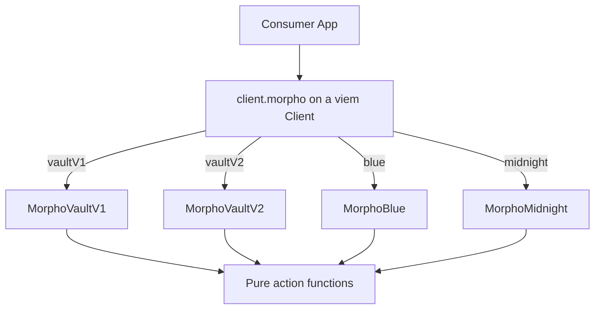

# Architecture

This document explains the design decisions, protocol context, and internal structure of the Morpho Consumer SDK.

## Purpose and Philosophy

The Consumer SDK is a TypeScript abstraction layer over the Morpho Protocol. Its job is to
build **ready-to-send transactions** for Morpho protocol operations on EVM-compatible chains.

**Design principles:**

- **Deterministic transaction building.** Given the same inputs and on-chain state, the SDK
  always produces the same `Transaction` object. No simulation, no gas estimation, no
  sending — the consumer handles those concerns.
- **Predictable developer experience.** Operations with prerequisites return lazy
  `{ buildTx, getRequirements }` handles; direct vault operations with no prerequisites return
  `{ buildTx }`. `getRequirements()` owns reads and `buildTx()` stays synchronous.
- **Immutability.** Every returned `Transaction` is deep-frozen via `@morpho-org/morpho-ts`'s
  `deepFreeze`. Once built, a transaction object cannot be mutated.
- **No `any`.** Strict TypeScript throughout, with discriminated unions for action types and
  dedicated error classes for every failure mode.

The SDK intentionally does **not** simulate or execute transactions. It produces the calldata;
the consuming application decides when and how to send it.

## Layered Architecture



### Why this layering exists

Each layer has a single responsibility and a strict boundary:

| Layer      | Responsibility                                                                                                                                  | What it must NOT do                           |
| ---------- | ----------------------------------------------------------------------------------------------------------------------------------------------- | --------------------------------------------- |
| **Client** | Wrap a viem `Client`, normalize SDK options (`supportSignature`, `metadata`, `supportDeployless`), produce vault, Blue, and Midnight entities                | Call actions directly, hold mutable state     |
| **Entity** | Fetch on-chain data (vault accrual data for V1/V2, market/position data for Blue and Midnight), compute derived values (for example vault `maxSharePrice` and the Blue LLTV buffer), delegate to actions | Encode calldata, know about contract-call internals |
| **Action** | Validate inputs, encode calldata, deep-freeze the result, return a `Transaction<TAction>`                                                       | Fetch data, hold state, mutate anything       |

**Calls flow strictly downward**: Client → Entity → Action. An action never calls an entity;
an entity never instantiates a client.

## VaultV1 vs VaultV2: Technical Differences

Both vault versions are ERC-4626 compliant and share the same deposit/withdraw/redeem interface
at the SDK level. The differences are at the protocol layer:

### VaultV1 (MetaMorpho)

- **Market allocation**: A curator-managed set of Morpho Blue markets. The vault allocates
  deposits across these markets according to a supply queue.
- **Roles**: Owner, guardian, curator, allocator. The curator manages market lists and caps;
  allocators can reallocate between markets.
- **Fee structure**: A single performance fee set by the owner, applied to interest earned.
- **Withdrawal**: Users withdraw from a withdraw queue of markets. If a market is illiquid,
  the withdrawal may be partial — there is no mechanism to force liquidity out.
- **Contract**: Uses `metaMorphoAbi` from `@morpho-org/blue-sdk-viem`.
- **SDK data**: Fetched via `fetchVault` / `fetchAccrualVault`.

### VaultV2

- **Adapter-based allocation**: Instead of directly allocated markets, V2 uses an
  **adapter system**. Each adapter is a contract that interfaces with a specific yield source
  (Morpho Blue markets, other V1 vaults, etc.). The vault allocates to adapters, not directly
  to markets.
- **Roles**: Expanded role system with more granular permissions.
- **Fee structure**: More flexible fee configuration.
- **Gate system**: V2 can gate deposits and withdrawals behind configurable conditions.
- **Force deallocation**: The key V2 innovation for the SDK. When liquidity is locked in
  adapters, any user can call `forceDeallocate` to pull assets back into the vault's idle
  balance — at the cost of a penalty (share burn). This enables withdrawals even when the
  vault's idle liquidity is insufficient.
- **Native multicall**: V2 contracts expose a `multicall` function, allowing multiple
  operations (N `forceDeallocate` + 1 `withdraw`/`redeem`) to execute atomically in a single
  transaction.
- **Contract**: Uses `vaultV2Abi` from `@morpho-org/blue-sdk-viem`.
- **SDK data**: Fetched via `fetchVaultV2` / `fetchAccrualVaultV2`.

### Blue (Morpho Blue)

- **Market-based lending**: Blue (a.k.a. Morpho Blue) is Morpho's immutable, variable-rate
  lending primitive — isolated markets whose borrow rate floats with utilization via the market's
  IRM. Each market has a loan token, collateral token, oracle, IRM, and LLTV (liquidation
  loan-to-value). Formerly referred to as "MarketV1" in this SDK.
- **Write routing**: `client.morpho.blue(marketParams, chainId)` preserves `supply`, `withdraw`,
  `supplyCollateral`, `borrow`, `supplyCollateralBorrow`, `repay`, `withdrawCollateral`,
  `repayWithdrawCollateral`, and `refinance`. These methods map to the five registered
  BlueBundlesV1 entrypoints. There is no Bundler3 fallback or second BlueBundlesV1 entity.
- **Contract-owned composition**: BlueBundlesV1 enforces token pulls, optional native wrapping,
  operation ordering, Morpho authorization consumption, referral fees, refunds, and residue
  handling. Combined methods support either non-zero leg or both legs.
- **LLTV buffer**: Borrow, collateral-withdraw, and migration legs validate that the resulting
  position stays below `LLTV - buffer` (default 0.5%). Pure collateral supply and pure repay disable
  the onchain LTV cap so they can improve an unhealthy position.
- **No Blue share-price slippage input**: BlueBundlesV1 has no Bundler3 `minSharePrice` /
  `maxSharePrice` checks, so high-level Blue writes do not accept `slippageTolerance`.
- **V2-only write reallocations**: Optional high-level Blue reallocations are
  `VaultV2BlueReallocation` calls mapped to BlueBundlesV1 `PublicAllocations`. PublicAllocator V1
  data and low-level helpers remain public but are not accepted by these writes.
- **SDK data**: Fetched via `fetchBlueMarket` / `fetchBlueAccrualPosition`.
  `BlueAccrualPosition` provides health metrics: `maxBorrowAssets`, `ltv`, `isHealthy`,
  `borrowAssets`, `collateral`.

### Midnight

- **Fixed-rate markets**: Midnight represents lending and borrowing through signed or
  contract-ratified offers with prices fixed until market maturity.
- **Taker routing**: Asset-targeted takes and repay/withdraw flows call `MidnightBundles`;
  collateral supply, credit redemption, and cancellation call Midnight directly.
- **Maker routing**: Maker flows build and validate offer trees, collect an Ecrecover root
  signature or SetterRatifier transaction, then submit the payload to the Midnight mempool.
- **SDK data**: `MorphoMidnight` fetches hydrated market and position snapshots and exposes
  the same lazy `{ getRequirements, buildTx }` contract as the other entities.


### Force Deallocation (V2 only)

Force deallocation solves the liquidity problem: when vault assets are
locked in adapters (e.g. lent in a Morpho Blue market with no available liquidity), a user can
force the vault to pull assets back to vault level and withdraw/redeem after.

## Contract Routing

This is the most important routing decision in the SDK. "Bundled" does not always mean Bundler3:
Vaults, Blue, and Midnight use fixed, protocol-owned bundle contracts directly.

### Vault deposits: Direct VaultBundlesV1 calls

Both vault versions call `vaultBundlesV1Deposit` on the chain's registered
`bundles.vaultBundlesV1` deployment. The contract atomically:

1. Pulls the gross ERC-20 `amount`, consuming an optional ERC-2612 or Permit2 SignatureTransfer
   permit, or wraps the exclusive `nativeAmount` supplied as `tx.value`.
2. Deducts `referralFeeAssets = amount * referralFeePct / WAD`, rounded down.
3. Deposits the remaining `netAssets` into the vault, minting shares to the transaction sender
   and enforcing `maxSharePrice` and the execution `deadline`.

The entity computes `maxSharePrice` from the net deposit assets and the supplied vault snapshot
accrued through the deadline, including slippage tolerance and vault share rounding. The
VaultBundlesV1 share-price check provides atomic protection against ERC-4626 inflation attacks.
High-level deposits must preserve this guard.

Funding accepts exactly one of `amount` or `nativeAmount`. Native funding requires the vault asset
to be the chain's wrapped-native token, otherwise `NativeAmountOnNonWNativeVaultError` is thrown.
It needs no token approval or permit; `tx.value` is the full gross native amount and wrapping
happens inside VaultBundlesV1. The action does not encode Bundler3 sub-actions.

Classic approvals and ERC-2612 permits name VaultBundlesV1 as spender. Permit2 SignatureTransfer
keeps the ERC-20 allowance on canonical Permit2 and names VaultBundlesV1 in the signed transfer.
Each chain must have a registered VaultBundlesV1 deployment; missing deployments throw
`UnknownAddressError`. Check the [migration guide](./MIGRATION-v5-to-v6.md) for chain availability.

Vault V1 `migrateToV2` uses the same fixed contract: it exits the source by exact assets or shares,
then deposits net assets into Vault V2 with a destination maximum-share-price bound.

### Withdrawals and redemptions: VaultBundlesV1

**Withdraw (V1 & V2)** routes through the chain's registered **VaultBundlesV1** periphery
contract — not the vault directly, and not through Bundler3/the general adapter. VaultBundlesV1
burns `msg.sender`'s vault shares and pays out the requested `assets`, minus an optional referral
fee. Because asset-mode calldata carries no maximum-shares argument, the vault-share allowance
_is_ the only cap on that burn: `getRequirements()` derives the exact allowance from the vault
snapshot, deadline, and slippage tolerance, and returns an approval — or an ERC-2612 shares permit
folded into the call when `supportSignature` is enabled — for exactly that amount. An allowance
that does not equal the derived cap, including a larger leftover approval, is replaced rather than
reused, so the cap holds on every withdrawal.

**Redeem (V1 & V2)** also routes through VaultBundlesV1. The caller grants an exact share
allowance or signs an embedded ERC-2612 permit. The fixed call redeems the specified shares and
pays the proceeds, minus an optional referral fee, to the submitting account. It has no
minimum-assets or source share-price bound.

### Force Withdrawals (V2 only): VaultExitBundlesV1

`forceWithdraw` calls the standalone **VaultExitBundlesV1** periphery — not the bundler, and no
longer the vault's own `multicall`. The contract computes its own `forceDeallocate` sequence by
walking the sole adapter's market list, withdraws idle assets and liquidity-adapter liquidity
penalty-free first, and bounds the realized exit share price with `minSharePriceE27`. The caller
supplies an amount, not a plan.

**New prerequisite:** because the periphery burns the user's shares rather than `msg.sender`'s own,
`forceWithdraw` requires a vault-share allowance or ERC-2612 permit to VaultExitBundlesV1 (bounded to
the exit's full burn), and the vault's `receiveAssetsGate` must allow that periphery as an asset
recipient. `tx.to` is VaultExitBundlesV1, not the vault.

### Force Redeems (V2 only): VaultV2 multicall

`forceRedeem` uses the VaultV2 contract's native `multicall` — not the bundler. The multicall bundles
N caller-supplied `forceDeallocate` calls + 1 `redeem` into a single atomic transaction on the vault
contract itself. It has no on-chain share-price bound, and the caller plans the deallocations.

### Blue writes: direct BlueBundlesV1 calls

The Blue methods build direct BlueBundlesV1 transactions. Requirements authorize the actual
puller/operator: classic approvals and ERC-2612 permits target BlueBundlesV1; Permit2 keeps its
ERC-20 prerequisite on canonical Permit2 while its SignatureTransfer payload targets
BlueBundlesV1; Morpho authorization grants BlueBundlesV1 operator rights.

BlueBundlesV1 entrypoints own the atomic ordering. Vault V2 public allocations are encoded inside
the fixed call rather than prepended as arbitrary Bundler3 actions. Blue writes therefore have no
GeneralAdapter1 approval, PublicAllocator V1 plan, or Bundler3 share-price-bound input.

### Summary

| Operation                             | Route                      | Why                                                                                                        |
| ------------------------------------- | -------------------------- | ---------------------------------------------------------------------------------------------------------- |
| Deposit (V1 & V2)                     | VaultBundlesV1 | `maxSharePrice` enforcement, exclusive ERC-20/native funding, referral fee, and deadline. |
| Withdraw (V1 & V2)                    | VaultBundlesV1 | No inflation-attack surface; exact vault-share allowance caps the burn against share-price loss. |
| Redeem (V1 & V2)                      | VaultBundlesV1             | Exact shares with share approval or permit                                                                      |
| Force Withdraw (V2)                   | VaultExitBundlesV1         | Contract-computed deallocations + `minSharePriceE27` bound. Needs a vault-share allowance or permit.       |
| Force Redeem (V2)                     | VaultV2 `multicall`        | Atomic deallocation + redemption on the vault contract                                                     |
| `supply` (Blue)                        | BlueBundlesV1             | Pull or wrap loan assets, charge an optional fee, and supply the remainder.                                |
| `supplyCollateral`, `borrow`, `supplyCollateralBorrow` (Blue) | BlueBundlesV1 | Execute either leg or both; optional Vault V2 allocations on borrow; buffered LLTV on borrow. |
| `repay`, `withdrawCollateral`, `repayWithdrawCollateral` (Blue) | BlueBundlesV1 | Repay before collateral withdrawal; refund unused bounded repay funding. |
| `withdraw` (Blue)                      | BlueBundlesV1             | Withdraw by assets or shares; optional Vault V2 allocations.                                               |
| `refinance` (Blue)                     | BlueBundlesV1             | Move the caller's full compatible debt-and-collateral position.                                            |

## Dependency Map

The SDK builds on the Morpho TypeScript ecosystem. Each dependency has a specific role:

```
morpho-sdk
├── @morpho-org/blue-sdk           Core protocol constants and math
├── @morpho-org/blue-sdk-viem      On-chain data fetching and ABIs
├── @morpho-org/midnight-sdk       Midnight market models, offer trees, math, and ABIs
├── @morpho-org/morpho-ts          Shared utilities (deepFreeze, Time)
└── viem                           Ethereum client and ABI encoding
```

### `@morpho-org/blue-sdk`

Provides protocol-level constants and math:

- **`getChainAddresses(chainId)`** — resolves contract addresses for the target chain, including
  `bundler3.generalAdapter1`, `bundles.blueBundlesV1`, `bundles.vaultBundlesV1`, `permit2`, and others.
- **`MathLib`** — fixed-point arithmetic (`mulDivUp`, `wToRay`, `min`, `WAD`, `RAY`).
- **`DEFAULT_SLIPPAGE_TOLERANCE`** — the default 0.03% slippage used for deposit `maxSharePrice`.
- **`MarketParams`** and **`marketParamsAbi`** — used when encoding force-deallocation data
  for Morpho Market V1 adapters.

### `@morpho-org/blue-sdk-viem`

On-chain data fetching and contract ABIs:

- **ABIs**: `metaMorphoAbi` (V1) and `vaultV2Abi` (V2) — used for calldata encoding in actions.
- **Fetchers**: `fetchVault`, `fetchAccrualVault` (V1), `fetchVaultV2`, `fetchAccrualVaultV2`
  (V2) — read vault state from the blockchain.
- **`fetchHolding`** — reads a user's token allowances, EIP-2612 nonce, and Permit2 state.
  Used by the requirements system to determine what approvals are needed.
- **`fetchToken`** — token metadata lookups.
- **Typed data helpers**: `getPermitTypedData`, `getPermit2PermitTypedData`, and
  `getPermit2TransferFromTypedData` — used to build EIP-712 signing payloads for ERC-2612,
  Permit2 AllowanceTransfer, and Permit2 SignatureTransfer flows.

### Local VaultBundlesV1 ABI

`vaultBundlesV1Abi` is pinned in this package's [`src/abis.ts`](./src/abis.ts) and exported from
`@morpho-org/morpho-sdk/abis`. Both vault deposit builders use this local ABI to encode
`vaultBundlesV1Deposit`.

### Local Bundler Encoding

Explicit low-level bundle encoding:

- **`BundlerAction.encodeBundle(chainId, actions)`** — takes an array of bundler `Action`
  objects (e.g. `erc20TransferFrom`, `erc4626Deposit`, `permit`, `approve2`, `transferFrom2`)
  and encodes them into a single calldata blob targeting the Bundler3 contract.
- **`Action` type** — the typed action union used inside bundles.

### `@morpho-org/morpho-ts`

Shared utilities:

- **`deepFreeze`** — recursively freezes objects. Applied to every returned `Transaction`.
- **`Time`** — timestamp helpers used for permit deadlines and metadata timestamps.
- **`isDefined`** — type-narrowing utility used in the requirements decision tree.

## Requirements System

Before a token-funded action, the user may need an approval or signature. The requirements system
resolves only the prerequisites consumed by the selected route.

### Vault requirements target VaultBundlesV1

Vault deposits flow: **user → VaultBundlesV1 → vault**. Requirements cover the gross funding
amount, before the referral fee. Native deposits return no token requirements.

For ERC-20 deposits, `getBundlesTokenRequirements` resolves the selected route:

| Route | Prerequisites |
| --- | --- |
| `supportSignature: false` (default) | Check ERC-20 allowance to VaultBundlesV1. Return an exact approval if insufficient, preceded by a zero reset for tokens that require it. |
| `supportSignature: true`, `useSimplePermit: true`, compatible ERC-2612 token | Read the token nonce and metadata; return a signable permit naming VaultBundlesV1. |
| Signature support with canonical Permit2 available | Check the ERC-20 allowance to Permit2 and the owner nonce bitmap. Return any required Permit2 approval and a SignatureTransfer requirement naming VaultBundlesV1. An explicit unused `permit2Nonce` is mandatory. |
| No available signature route | Fall back to the classic VaultBundlesV1 approval check. |

Concurrent `getRequirements()` calls share one in-flight read and its first caller's options.
After that read settles, the next call refreshes allowance and nonce state using its own options.
`buildTx()` validates signatures against the latest completed resolution; collect and submit the
signature from that resolution. The handle retains its original deadline and share-price bound.

Withdrawals, redemptions, and V1-to-V2 migrations resolve source-vault share authorization. The
allowance must equal the resolved share cap; an existing larger allowance is replaced. Asset-mode
withdrawals re-read allowance on every `getRequirements()` call while keeping their quoted cap
fixed. Signatures and unsigned approvals use the same VaultBundlesV1 spender.

The low-level `getGeneralAdapterRequirements` resolver remains available for explicit Bundler3
composition using GeneralAdapter1 and Permit2 AllowanceTransfer.

### BlueBundlesV1 requirement decision

Blue token requirements resolve against the direct contract route:

- Without signature support, check the ERC-20 allowance to BlueBundlesV1 and return a classic
  approval only when it is insufficient.
- With `useSimplePermit`, use ERC-2612 when the token supports the standard permit shape; its
  spender is BlueBundlesV1.
- Otherwise, use Permit2 SignatureTransfer when canonical Permit2 is configured. The prerequisite
  ERC-20 allowance targets Permit2, and the one-shot signature names BlueBundlesV1 as spender.
- Fall back to a classic BlueBundlesV1 approval when neither signature path is available.

Loan-asset withdrawal, borrow, collateral-withdraw, and migration legs also check
`Morpho.isAuthorized(userAddress, blueBundlesV1)`. Depending on `supportSignature`, the missing
authorization is returned as a standalone Morpho transaction or a signable requirement consumed
inside the BlueBundlesV1 call.

### How signatures flow into fixed bundles

Call `requirement.sign(walletClient, userAddress)` for a signable requirement and pass the result
to the same prepared handle's `buildTx([signature])`. Submit any approval transactions and wait
for their receipts before sending the deposit transaction.

```
getRequirements() → Requirement { sign() } → RequirementSignature → buildTx([signature])
```

The builder reshapes the accepted ERC-2612 or Permit2 SignatureTransfer signature into the
`TokenPermit` struct inside `vaultBundlesV1Deposit`. The signature owner, asset, amount, spender,
nonce, and deadline must match the prepared requirement. With classic approval, `buildTx()`
encodes an empty token permit and VaultBundlesV1 pulls the approved assets. Native funding also
uses an empty permit and rejects token signatures.

Direct BlueBundlesV1 writes use the same lazy collection workflow. Their builders additionally
reshape Morpho authorization signatures into fixed BlueBundlesV1 ABI structs.

Vault exits and migrations encode an ERC-2612 share permit in the fixed VaultBundlesV1 call.

### Guard functions

Two type guards distinguish requirement types in application code:

- `isRequirementApproval(r)` — true when `r` is a `Transaction<ERC20ApprovalAction>` (send as tx).
- `isRequirementSignature(r)` — true when `r` is a `Requirement` (needs signing first).
