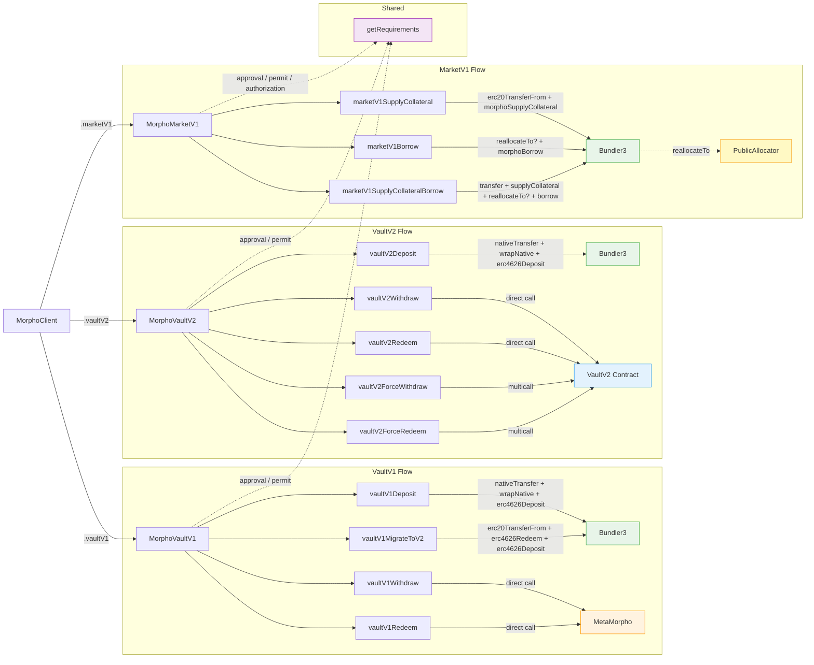

# @morpho-org/morpho-sdk

[](https://www.npmjs.com/package/@morpho-org/morpho-sdk)
[](https://www.typescriptlang.org/)
[](./LICENSE)
[](https://github.com/morpho-org/morpho-sdk/actions/workflows/ci.yml)

> **The abstraction layer that simplifies Morpho protocol**

Build transactions for **VaultV1** (MetaMorpho), **VaultV2**, and **MarketV1** (Morpho Blue) on EVM-compatible chains.

## Installation

```bash
pnpm add @morpho-org/morpho-sdk
```

## Entities & Actions

| Entity       | Action                    | Route                     | Why                                                                                                 |
| ------------ | ------------------------- | ------------------------- | --------------------------------------------------------------------------------------------------- |
| **VaultV2**  | `deposit`                 | Bundler (general adapter) | Enforces `maxSharePrice` — inflation attack prevention. Supports native token wrapping.             |
|              | `withdraw`                | Direct vault call         | No attack surface, no bundler overhead needed                                                       |
|              | `redeem`                  | Direct vault call         | No attack surface, no bundler overhead needed                                                       |
|              | `forceWithdraw`           | Vault `multicall`         | N `forceDeallocate` + 1 `withdraw` in a single tx                                                   |
|              | `forceRedeem`             | Vault `multicall`         | N `forceDeallocate` + 1 `redeem` in a single tx                                                     |
| **VaultV1**  | `deposit`                 | Bundler (general adapter) | Same ERC-4626 inflation attack prevention as V2. Supports native token wrapping.                    |
|              | `withdraw`                | Direct vault call         | No attack surface                                                                                   |
|              | `redeem`                  | Direct vault call         | No attack surface                                                                                   |
| **MarketV1** | `supplyCollateral`        | Bundler (general adapter) | `erc20TransferFrom` + `morphoSupplyCollateral`. Supports native wrapping.                           |
|              | `borrow`                  | Bundler (general adapter) | `morphoBorrow` with `minSharePrice` slippage protection. Requires GA1 auth. Supports reallocations. |
|              | `supplyCollateralBorrow`  | Bundler (general adapter) | Atomic supply + borrow. LLTV buffer prevents instant liquidation. Supports reallocations.           |
|              | `repay`                   | Bundler (general adapter) | `erc20TransferFrom` + `morphoRepay` with `maxSharePrice` protection. Supports partial or full.      |
|              | `withdrawCollateral`      | Direct Morpho call        | No bundler overhead. Validates position health after withdrawal.                                    |
|              | `repayWithdrawCollateral` | Bundler (general adapter) | Atomic repay + withdraw. Bundle order matters: repay first, then withdraw.                          |

## The `getRequirements` flow

Every action that touches a user's tokens or positions returns two things:

- `buildTx(signature?)` — builds the final viem `Transaction` object.
- `getRequirements()` — returns the list of on-chain pre-requisites that must be satisfied first.

Typical requirements:

- **ERC-20 approval** — the user must approve the bundler (or Morpho directly) to pull tokens. Returned as a standard `approve` transaction the consumer sends first.
- **Permit / Permit2 signature** — off-chain approvals that go into `buildTx` as a `signature` argument, avoiding the extra approval tx. Enabled via `MorphoClient({ supportSignature: true })`.
- **Morpho authorization** — `borrow`, `supplyCollateralBorrow`, and `repayWithdrawCollateral` require the user to authorize `GeneralAdapter1` on the Morpho contract once (`setAuthorization`). The SDK returns this as an extra transaction if it's missing.

Usage pattern:

```typescript
const { buildTx, getRequirements } = await vault.deposit({
  /* ... */
});

const requirements = await getRequirements();
// → [{ type: "approval", tx: {...} }, { type: "permit", sign: async () => {...} }]

// Consumer satisfies each requirement (send tx / sign permit), collects the signature,
// then calls buildTx to get the final transaction:
const tx = buildTx(permitSignature);
```

## Integration invariant — builder = signer

**`userAddress` MUST equal the connected account on the viem client used to build the tx, and that same client MUST sign it.** Enforced by `validateUserAddress` (throws `MissingClientPropertyError` / `AddressMismatchError`); critical for `repayWithdrawCollateral`, whose bundle mixes explicit `onBehalf` (repay) with implicit `msg.sender` (transfer-from + withdraw) — see [BUNDLER3.md](./BUNDLER3.md#other-pitfalls).

| Entity       | Action                   | Route                     | Why                                                                                                 |
| ------------ | ------------------------ | ------------------------- | --------------------------------------------------------------------------------------------------- |
| **VaultV2**  | `deposit`                | Bundler (general adapter) | Enforces `maxSharePrice` — inflation attack prevention. Supports native token wrapping.             |
|              | `withdraw`               | Direct vault call         | No attack surface, no bundler overhead needed                                                       |
|              | `redeem`                 | Direct vault call         | No attack surface, no bundler overhead needed                                                       |
|              | `forceWithdraw`          | Vault `multicall`         | N `forceDeallocate` + 1 `withdraw` in a single tx                                                   |
|              | `forceRedeem`            | Vault `multicall`         | N `forceDeallocate` + 1 `redeem` in a single tx                                                     |
| **VaultV1**  | `deposit`                | Bundler (general adapter) | Same ERC-4626 inflation attack prevention as V2. Supports native token wrapping.                    |
|              | `withdraw`               | Direct vault call         | No attack surface                                                                                   |
|              | `redeem`                 | Direct vault call         | No attack surface                                                                                   |
|              | `migrateToV2`            | Bundler (general adapter) | Atomic V1 → V2 migration: redeem V1 shares + deposit into V2 in one tx. Slippage-protected.         |
| **MarketV1** | `supplyCollateral`       | Bundler (general adapter) | `erc20TransferFrom` + `morphoSupplyCollateral`. Supports native wrapping.                           |
|              | `borrow`                 | Bundler (general adapter) | `morphoBorrow` with `minSharePrice` slippage protection. Requires GA1 auth. Supports reallocations. |
|              | `supplyCollateralBorrow` | Bundler (general adapter) | Atomic supply + borrow. LLTV buffer prevents instant liquidation. Supports reallocations.           |

## VaultV2

```typescript
import { MorphoClient } from "@morpho-org/morpho-sdk";
import { createPublicClient, http } from "viem";
import { mainnet } from "viem/chains";

const viemClient = createPublicClient({ chain: mainnet, transport: http() });
const morpho = new MorphoClient(viemClient);

const vault = morpho.vaultV2("0xVault...", 1);
```

### Deposit

```typescript
const { buildTx, getRequirements } = await vault.deposit({
  amount: 1000000000000000000n,
  userAddress: "0xUser...",
});

const requirements = await getRequirements();
const tx = buildTx(requirementSignature);
```

#### Deposit with native token wrapping

For vaults whose underlying asset is wNative, you can deposit native token that will be automatically wrapped:

```typescript
// Native ETH only — wraps 1 ETH to WETH and deposits
const { buildTx, getRequirements } = await vault.deposit({
  nativeAmount: 1000000000000000000n,
  userAddress: "0xUser...",
});

// Mixed — 0.5 WETH (ERC-20) + 0.5 native ETH wrapped to WETH
const { buildTx, getRequirements } = await vault.deposit({
  amount: 500000000000000000n,
  nativeAmount: 500000000000000000n,
  userAddress: "0xUser...",
});
```

The bundler atomically transfers native token, wraps it to wNative, and deposits alongside any ERC-20 amount. The transaction's `value` field is set to `nativeAmount`.

### Withdraw

```typescript
const { buildTx } = vault.withdraw({
  amount: 500000000000000000n,
  userAddress: "0xUser...",
});

const tx = buildTx();
```

### Redeem

```typescript
const { buildTx } = vault.redeem({
  shares: 1000000000000000000n,
  userAddress: "0xUser...",
});

const tx = buildTx();
```

### Force Withdraw

```typescript
const { buildTx } = vault.forceWithdraw({
  deallocations: [{ adapter: "0xAdapter...", amount: 100n }],
  withdraw: { amount: 500000000000000000n },
  userAddress: "0xUser...",
});

const tx = buildTx();
```

### Force Redeem

```typescript
const { buildTx } = vault.forceRedeem({
  deallocations: [{ adapter: "0xAdapter...", amount: 100n }],
  redeem: { shares: 1000000000000000000n },
  userAddress: "0xUser...",
});

const tx = buildTx();
```

## VaultV1

```typescript
const vault = morpho.vaultV1("0xVault...", 1);
```

### Deposit

```typescript
const { buildTx, getRequirements } = await vault.deposit({
  amount: 1000000000000000000n,
  userAddress: "0xUser...",
});

const requirements = await getRequirements();
const tx = buildTx(requirementSignature);
```

### Withdraw

```typescript
const { buildTx } = vault.withdraw({
  amount: 500000000000000000n,
  userAddress: "0xUser...",
});

const tx = buildTx();
```

### Redeem

```typescript
const { buildTx } = vault.redeem({
  shares: 1000000000000000000n,
  userAddress: "0xUser...",
});

const tx = buildTx();
```

### Migrate to V2

Atomically migrate a full position from a VaultV1 (MetaMorpho) vault into a VaultV2 vault. The bundler redeems the V1 shares and deposits the resulting assets into V2 in a single transaction. Both vaults must share the same underlying asset.

```typescript
const sourceVault = morpho.vaultV1("0xV1Vault...", 1);
const targetVault = morpho.vaultV2("0xV2Vault...", 1);

const { buildTx, getRequirements } = sourceVault.migrateToV2({
  userAddress: "0xUser...",
  sourceVault: await sourceVault.getData(),
  targetVault: await targetVault.getData(),
  shares: 1000000000000000000n,
});

const requirements = await getRequirements();
const tx = buildTx(requirementSignature);
```

## MarketV1

```typescript
const market = morpho.marketV1(
  {
    loanToken: "0xLoan...",
    collateralToken: "0xCollateral...",
    oracle: "0xOracle...",
    irm: "0xIrm...",
    lltv: 860000000000000000n,
  },
  1
);
```

### Supply Collateral

```typescript
const { buildTx, getRequirements } = market.supplyCollateral({
  amount: 1000000000000000000n,
  userAddress: "0xUser...",
});

const requirements = await getRequirements();
const tx = buildTx(requirementSignature);
```

### Borrow

```typescript
const positionData = await market.getPositionData("0xUser...");

const { buildTx, getRequirements } = market.borrow({
  amount: 500000000000000000n,
  userAddress: "0xUser...",
  positionData,
});

const requirements = await getRequirements();
const tx = buildTx();
```

### Supply Collateral & Borrow

```typescript
const positionData = await market.getPositionData("0xUser...");

const { buildTx, getRequirements } = market.supplyCollateralBorrow({
  amount: 1000000000000000000n,
  borrowAmount: 500000000000000000n,
  userAddress: "0xUser...",
  positionData,
});

const requirements = await getRequirements();
const tx = buildTx(requirementSignature);
```

### Repay

Two modes depending on whether the caller specifies `assets` (partial repay) or `shares` (full repay, immune to interest accrual between quote and inclusion):

```typescript
const positionData = await market.getPositionData("0xUser...");

// Partial repay — by assets
const { buildTx, getRequirements } = market.repay({
  assets: 250000000000000000n,
  userAddress: "0xUser...",
  positionData,
});

// Full repay — by shares (recommended to clear the full debt atomically)
const { buildTx, getRequirements } = market.repay({
  shares: positionData.borrowShares,
  userAddress: "0xUser...",
  positionData,
});

const requirements = await getRequirements();
const tx = buildTx(requirementSignature);
```

Repay does **not** require Morpho authorization (it only requires a loan token approval for `GeneralAdapter1`).

### Withdraw Collateral

```typescript
const positionData = await market.getPositionData("0xUser...");

const { buildTx } = market.withdrawCollateral({
  amount: 500000000000000000n,
  userAddress: "0xUser...",
  positionData,
});

const tx = buildTx();
```

Direct call to `morpho.withdrawCollateral()` — no bundler, no `GeneralAdapter1` authorization needed. The SDK validates position health after withdrawal against the LLTV buffer to prevent instant liquidation.

### Repay & Withdraw Collateral

```typescript
const positionData = await market.getPositionData("0xUser...");

const { buildTx, getRequirements } = market.repayWithdrawCollateral({
  assets: 250000000000000000n, // or shares: ...
  withdrawAmount: 500000000000000000n,
  userAddress: "0xUser...",
  positionData,
});

const requirements = await getRequirements();
const tx = buildTx(requirementSignature);
```

Atomically bundles repay → withdraw collateral via bundler3. Bundle order is critical: repay runs first to reduce debt, then withdraw. Requires both a loan token approval (for repay) and a Morpho authorization (for withdraw). The SDK validates combined position health by simulating the repay before checking withdrawal safety.

### Borrow with Shared Liquidity (Reallocations)

When a market lacks sufficient liquidity, you can reallocate liquidity from other markets managed by MetaMorpho Vaults via the **PublicAllocator** contract:

```typescript
import type { VaultReallocation } from "@morpho-org/morpho-sdk";

const reallocations: VaultReallocation[] = [
  {
    vault: "0xVault...", // MetaMorpho vault to reallocate from
    fee: 0n, // PublicAllocator fee in native token (can be 0)
    withdrawals: [
      {
        marketParams: sourceMarketParams, // Source market to withdraw from
        amount: 2000000000n, // Amount to withdraw
      },
    ],
  },
];

const positionData = await market.getPositionData("0xUser...");

// Borrow with reallocations
const { buildTx, getRequirements } = market.borrow({
  amount: 500000000000000000n,
  userAddress: "0xUser...",
  positionData,
  reallocations,
});

const requirements = await getRequirements();
const tx = buildTx();
// tx.value includes the sum of all reallocation fees
```

Reallocations also work with `supplyCollateralBorrow`:

```typescript
const { buildTx, getRequirements } = market.supplyCollateralBorrow({
  amount: 1000000000000000000n,
  borrowAmount: 500000000000000000n,
  userAddress: "0xUser...",
  positionData,
  reallocations,
});
```

## Architecture



## Local Development

Link this package to your app for local debugging:

```bash
# In this morpho-sdk project
pnpm run build:link
```

In your other project:

```bash
# Link the local package
pnpm link @morpho-org/morpho-sdk
```

## Contributing

Contributions are welcome. See [CONTRIBUTING.md](./CONTRIBUTING.md) for development setup, code style, and the PR workflow.

## Security

To report a vulnerability, see [SECURITY.md](./SECURITY.md). **Please do not open a public issue for security reports.**

## License

MIT — see [LICENSE](./LICENSE).
