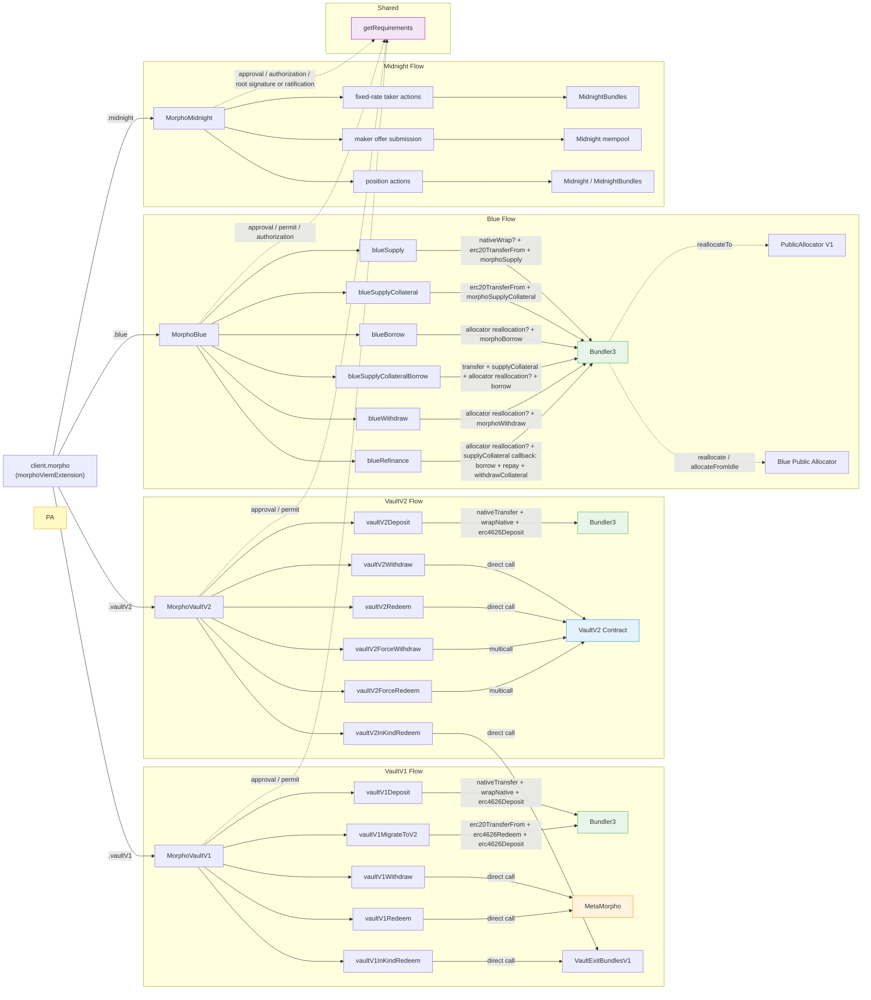

# @morpho-org/morpho-sdk

[](https://www.npmjs.com/package/@morpho-org/morpho-sdk)
[](https://www.typescriptlang.org/)
[](./LICENSE)
[](https://github.com/morpho-org/morpho-sdk/actions/workflows/ci.yml)

> 📖 **Full documentation → [docs.morpho.org/developers/sdks/morpho-sdk](https://docs.morpho.org/developers/sdks/morpho-sdk/)**

Build transactions for Morpho's **VaultV1** (MetaMorpho), **VaultV2**, **Blue**, and **Midnight** fixed-rate markets on every chain where Morpho is deployed. Custom deployments can be added with `registerCustomAddresses` from `@morpho-org/blue-sdk`.

## Installation

```bash
pnpm add @morpho-org/morpho-sdk
```

## Actions

Each entity exposes a set of actions. Bundled actions route through bundler3 (via `GeneralAdapter1`); the rest are direct contract calls.

| Entity | Actions | Route |
| --- | --- | --- |
| **VaultV1** (MetaMorpho) | `deposit`, `migrateToV2` | Bundler |
| | `withdraw`, `redeem` | Direct call |
| | `inKindRedeem` | VaultExitBundlesV1 |
| **VaultV2** | `deposit` | Bundler |
| | `withdraw`, `redeem` | Direct call |
| | `forceWithdraw`, `forceRedeem` | Vault multicall |
| | `inKindRedeem` | VaultExitBundlesV1 |
| **Blue** | `supply`, `supplyCollateral`, `borrow`, `supplyCollateralBorrow`, `repay`, `withdraw`, `repayWithdrawCollateral`, `refinance` | Bundler |
| | `withdrawCollateral` | Direct call |
| **Midnight** | `takeLend`, `takeBorrow`, `supplyCollateralTakeBorrow`, `repayWithdrawCollateral` | Midnight Bundles |
| | `makeLend`, `makeBorrow` | Midnight mempool |
| | `supplyCollateral`, `redeem`, `cancelOffer` | Direct call |

`VaultExitBundlesV1` is registered on Ethereum, Base, Arbitrum, Optimism, Polygon, World Chain,
Unichain, HyperEVM, Katana, Monad, Stable, Tempo, and Robinhood Chain. Custom deployments can still
be configured with `registerCustomAddresses`.

## How it works

Actions that pull tokens or touch a position return `{ buildTx, getRequirements }`. Vault
`inKindRedeem` uses this shape so callers can await `getRequirements()` to check live Blue liquidity
and share authorization before invoking `buildTx()`. Calling `buildTx()` directly skips those
RPC-backed pre-flight checks. Other direct calls — vault `withdraw` / `redeem`, `forceWithdraw` /
`forceRedeem`, and Blue `withdrawCollateral` — have no prerequisites and return only `{ buildTx }`.

- **`getRequirements()`** — async; the on-chain prerequisites to satisfy first: ERC-20 approvals, permit / Permit2 signatures, Morpho authorization, or (for Midnight) operator authorization and offer-root signatures.
- **`buildTx(signatures?)`** — synchronous; the final, deep-frozen viem transaction. Pass any signatures collected from the requirements.

```typescript
const { buildTx, getRequirements } = await vault.deposit({ amount, userAddress });

const requirements = await getRequirements();
// Send each approval tx and collect each signature, then:
const tx = buildTx([permitSignature]);
```

Enable off-chain approvals (permit / Permit2) with `morphoViemExtension({ supportSignature: true })`.

### `userAddress` must be the signer

`userAddress` must be the account that signs and sends the transaction. Builders don't enforce this, but the signature helpers do — `sign()` throws `AddressMismatchError` when the wallet's account differs. It matters most for `repayWithdrawCollateral`; see [BUNDLER3.md](./BUNDLER3.md#other-pitfalls).

## Usage

```typescript
import {
  morphoViemExtension,
  isRequirementSignature,
} from "@morpho-org/morpho-sdk";
import { createPublicClient, createWalletClient, custom, http } from "viem";
import { mainnet } from "viem/chains";

// Reads on-chain state, extended with the `morpho` namespace.
const client = createPublicClient({ chain: mainnet, transport: http() }).extend(
  morphoViemExtension(),
);

// Signs permits and sends the approval / authorization transactions.
const walletClient = createWalletClient({
  account: "0xUser...",
  chain: mainnet,
  transport: custom(window.ethereum), // any EIP-1193 provider
});
```

Create an entity — every factory takes a chain ID as its last argument:

- `client.morpho.vaultV1(address, chainId)` / `client.morpho.vaultV2(address, chainId)`
- `client.morpho.blue(marketParams, chainId)`
- `client.morpho.midnight(chainId)`

### Vault deposit / withdraw

Deposit routes through the bundler and may require an approval or permit:

```typescript
const vault = client.morpho.vaultV2("0xVault...", 1);

const { buildTx, getRequirements } = await vault.deposit({
  amount: 1000000000000000000n,
  userAddress: "0xUser...",
});
const requirements = await getRequirements();
const tx = buildTx([permitSignature]);
```

Withdraw is a direct vault call with no requirements:

```typescript
const { buildTx } = vault.withdraw({
  amount: 500000000000000000n,
  userAddress: "0xUser...",
});
const tx = buildTx();
```

For wNative vaults, pass `nativeAmount` instead of `amount` to deposit native ETH (wrapped automatically).

### Blue: supply collateral & borrow

```typescript
const market = client.morpho.blue(
  {
    loanToken: "0xLoan...",
    collateralToken: "0xCollateral...",
    oracle: "0xOracle...",
    irm: "0xIrm...",
    lltv: 860000000000000000n,
  },
  1,
);

const positionData = await market.getPositionData("0xUser...");

const { buildTx, getRequirements } = market.supplyCollateralBorrow({
  amount: 1000000000000000000n, // collateral
  borrowAmount: 500000000000000000n, // loan asset
  userAddress: "0xUser...",
  positionData,
});

// This flow can return more than one requirement — a collateral approval/permit
// and a one-time Morpho authorization for GeneralAdapter1. Satisfy each and pass
// every collected signature to buildTx.
const signatures = [];
for (const requirement of await getRequirements()) {
  if (isRequirementSignature(requirement)) {
    signatures.push(await requirement.sign(walletClient, "0xUser..."));
  } else {
    await walletClient.sendTransaction(requirement); // approval / authorization tx
  }
}

const tx = buildTx(signatures);
```

The LLTV buffer guards against instant liquidation.

### Midnight: take a fixed-rate offer

```typescript
const midnight = client.morpho.midnight(8453);
const marketData = await midnight.getMarketData(marketId);

const output = midnight.takeLend({
  accountAddress: lender,
  marketData,
  assets: 1_000_000n,
  minUnits: 900_000n,
  takeableOffers: quote.data.takeableOffers,
  deadline,
});

const requirements = await output.getRequirements();
const tx = output.buildTx();
```

See the [documentation](https://docs.morpho.org/developers/sdks/morpho-sdk/) for the full API: native wrapping, PublicAllocator reallocations, V1 → V2 migration, refinance, force withdraw/redeem, and Midnight maker flows.

## Architecture


```mermaid
graph LR
    MC["client.morpho<br/>(morphoViemExtension)"]

    MC -->|.vaultV1| MV1
    MC -->|.vaultV2| MV2
    MC -->|.blue| MM1
    MC -->|.midnight| MN1

    subgraph VaultV1 Flow
        MV1[MorphoVaultV1]
        MV1 --> V1D[vaultV1Deposit]
        MV1 --> V1W[vaultV1Withdraw]
        MV1 --> V1R[vaultV1Redeem]
        MV1 --> V1IKR[vaultV1InKindRedeem]
        MV1 --> V1M[vaultV1MigrateToV2]

        V1D -->|nativeTransfer + wrapNative + erc4626Deposit| B1[Bundler3]
        V1W -->|direct call| MM[MetaMorpho]
        V1R -->|direct call| MM
        V1IKR -->|direct call| VEB[VaultExitBundlesV1]
        V1M -->|erc20TransferFrom + erc4626Redeem + erc4626Deposit| B1
    end

    subgraph VaultV2 Flow
        MV2[MorphoVaultV2]
        MV2 --> V2D[vaultV2Deposit]
        MV2 --> V2W[vaultV2Withdraw]
        MV2 --> V2R[vaultV2Redeem]
        MV2 --> V2IKR[vaultV2InKindRedeem]
        MV2 --> V2FW[vaultV2ForceWithdraw]
        MV2 --> V2FR[vaultV2ForceRedeem]

        V2D -->|nativeTransfer + wrapNative + erc4626Deposit| B2[Bundler3]
        V2W -->|direct call| V2C[VaultV2 Contract]
        V2R -->|direct call| V2C
        V2IKR -->|direct call| VEB
        V2FW -->|multicall| V2C
        V2FR -->|multicall| V2C
    end

    subgraph Blue Flow
        MM1[MorphoBlue]
        MM1 --> M1S[blueSupply]
        MM1 --> M1SC[blueSupplyCollateral]
        MM1 --> M1B[blueBorrow]
        MM1 --> M1SCB[blueSupplyCollateralBorrow]
        MM1 --> M1W[blueWithdraw]
        MM1 --> M1RF[blueRefinance]

        M1S -->|nativeWrap? + erc20TransferFrom + morphoSupply| B3[Bundler3]
        M1SC -->|erc20TransferFrom + morphoSupplyCollateral| B3
        M1B -->|allocator reallocation? + morphoBorrow| B3
        M1SCB -->|transfer + supplyCollateral + allocator reallocation? + borrow| B3
        M1W -->|allocator reallocation? + morphoWithdraw| B3
        M1RF -->|allocator reallocation? + supplyCollateral callback: borrow + repay + withdrawCollateral| B3

        B3 -.->|reallocateTo| PA1[PublicAllocator V1]
        B3 -.->|reallocate / allocateFromIdle| BPA[Blue Public Allocator]
    end

    subgraph Midnight Flow
        MN1[MorphoMidnight]
        MN1 --> MNT[fixed-rate taker actions]
        MN1 --> MNM[maker offer submission]
        MN1 --> MNP[position actions]
        MNT --> MNB[MidnightBundles]
        MNM --> MNMP[Midnight mempool]
        MNP --> MNC[Midnight / MidnightBundles]
    end


    subgraph Shared
        REQ[getRequirements]
    end

    MV1 -.->|approval / permit| REQ
    MV2 -.->|approval / permit| REQ
    MM1 -.->|approval / permit / authorization| REQ
    MN1 -.->|approval / authorization / root signature or ratification| REQ

    style B1 fill:#e8f5e9,stroke:#4caf50
    style B2 fill:#e8f5e9,stroke:#4caf50
    style B3 fill:#e8f5e9,stroke:#4caf50
    style MM fill:#fff3e0,stroke:#ff9800
    style V2C fill:#e3f2fd,stroke:#2196f3
    style REQ fill:#f3e5f5,stroke:#9c27b0
    style PA fill:#fff9c4,stroke:#f9a825
```

## Development

Link this package to your app for local debugging:

```bash
# In this morpho-sdk project
pnpm run build:link
```

```bash
# In your other project
pnpm link @morpho-org/morpho-sdk
```

Contribute from the monorepo root. See [CONTRIBUTING.md](../../CONTRIBUTING.md) for setup, checks, and package workflow. Report vulnerabilities through [SECURITY.md](../../SECURITY.md).

## License

MIT. See [LICENSE](./LICENSE).
