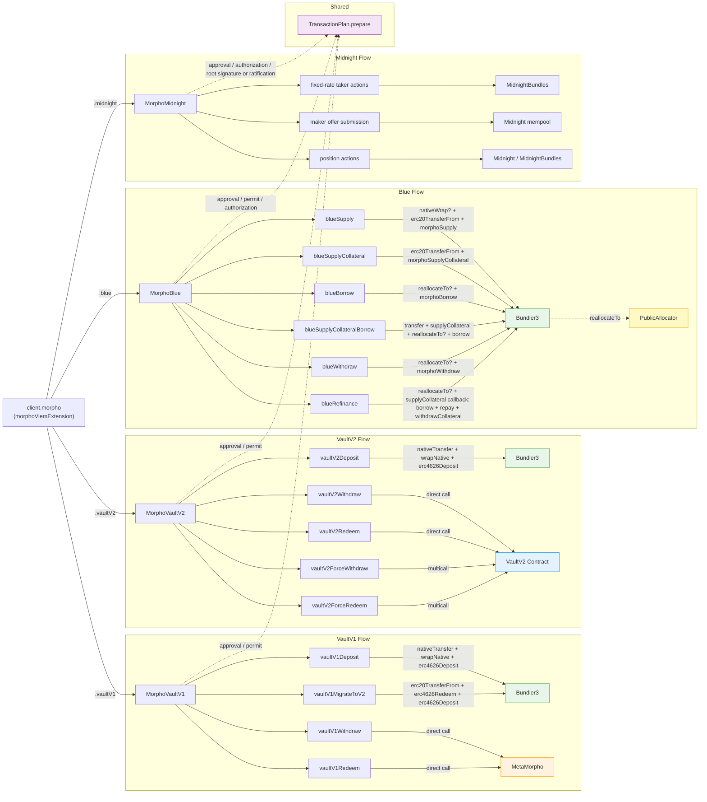

# @morpho-org/morpho-sdk

[](https://www.npmjs.com/package/@morpho-org/morpho-sdk)
[](https://www.typescriptlang.org/)
[](./LICENSE)
[](https://github.com/morpho-org/morpho-sdk/actions/workflows/ci.yml)

## Overview

> **The abstraction layer that simplifies Morpho protocol**

Build transactions for **VaultV1** (MetaMorpho), **VaultV2**, **Blue** (Morpho Blue), and **Midnight** fixed-rate markets on EVM-compatible chains.

## Installation

```bash
pnpm add @morpho-org/morpho-sdk
```

## Usage

### Entities & Actions

| Entity       | Action                    | Route                     | Why                                                                                                 |
| ------------ | ------------------------- | ------------------------- | --------------------------------------------------------------------------------------------------- |
| **VaultV2**  | `deposit`                 | Bundler (general adapter) | Enforces `maxSharePrice` — inflation attack prevention. Supports native token wrapping.             |
|              | `withdraw`                | Direct vault call         | No attack surface, no bundler overhead needed                                                       |
|              | `redeem`                  | Direct vault call         | No attack surface, no bundler overhead needed                                                       |
|              | `forceWithdraw`           | Vault `multicall`         | N `forceDeallocate` + 1 `withdraw` in a single tx                                                   |
|              | `forceRedeem`             | Vault `multicall`         | N `forceDeallocate` + 1 `redeem` in a single tx                                                     |
| **VaultV1**  | `deposit`                 | Bundler (general adapter) | Same ERC-4626 inflation attack prevention as V2. Supports native token wrapping.                    |
|              | `withdraw`                | Direct vault call         | No attack surface                                                                                   |
|              | `redeem`                  | Direct vault call         | No attack surface                                                                                   |
| **Blue** | `supply`                  | Bundler (general adapter) | `erc20TransferFrom` + `morphoSupply` with `maxSharePrice` (inflation guard). Supports native wrapping when `loanToken === wNative`. |
|              | `supplyCollateral`        | Bundler (general adapter) | `erc20TransferFrom` + `morphoSupplyCollateral`. Supports native wrapping.                           |
|              | `borrow`                  | Bundler (general adapter) | `morphoBorrow` with `minSharePrice` slippage protection. Requires GA1 auth. Supports reallocations. |
|              | `supplyCollateralBorrow`  | Bundler (general adapter) | Atomic supply + borrow. LLTV buffer prevents instant liquidation. Supports reallocations.           |
|              | `repay`                   | Bundler (general adapter) | `erc20TransferFrom` + `morphoRepay` with `maxSharePrice` protection. Supports partial or full.      |
|              | `withdraw`                | Bundler (general adapter) | `morphoWithdraw` with `minSharePrice` slippage protection. Requires GA1 auth. Supports reallocations. |
|              | `withdrawCollateral`      | Direct Morpho call        | No bundler overhead. Validates position health after withdrawal.                                    |
|              | `repayWithdrawCollateral` | Bundler (general adapter) | Atomic repay + withdraw. Bundle order matters: repay first, then withdraw.                          |
|              | `refinance`               | Bundler (general adapter) | Atomic position migration to another market with the same loan + collateral tokens. Flash-collateral via the target's `onMorphoSupplyCollateral` callback: borrow target → repay source → withdraw source collateral. Requires GA1 auth. Supports target reallocations. |
| **Midnight** | `takeLend` / `takeBorrow` | MidnightBundles | Takes fixed-rate offers with ordered approval and authorization requirements. |
|              | `supplyCollateralTakeBorrow` | MidnightBundles | Atomically supplies collateral and takes fixed-rate borrow liquidity. |
|              | `makeLend` / `makeBorrow` | Midnight mempool | Builds, validates, signs or ratifies, and submits maker offer trees. |
|              | `supplyCollateral` / `redeem` / `cancelOffer` | Direct Midnight call | Encodes direct collateral, credit, and offer-management operations. |
|              | `repayWithdrawCollateral` | MidnightBundles | Atomically repays credit and withdraws collateral. |

### Transaction plans

Every entity action returns a lazy `TransactionPlan`:

- `plan.prepare()` resolves the prerequisite call and signature requests for the chosen action.
- `prepared.signatureRequests` contains permits, Morpho authorizations, or Midnight offer-root
  signatures that the wallet must sign.
- `prepared.callRequests` contains prerequisite calls and, when it can be previewed without a
  signature, the primary call last.
- `prepared.build(signatures)` returns the executable calls, ordered with the primary call last.

Typical requirements:

- **ERC-20 approval** — the user must approve the bundler (or Morpho directly) to pull tokens. Returned as a standard `approve` transaction the consumer sends first.
- **Permit / Permit2 signature** — off-chain approvals passed to `prepared.build(signatures)`,
  avoiding the extra approval tx. Enabled via
  `morphoViemExtension({ supportSignature: true })`.
- **Morpho authorization** — `borrow`, `supplyCollateralBorrow`, and `repayWithdrawCollateral` require the user to authorize `GeneralAdapter1` on the Morpho contract once (`setAuthorization`). The SDK returns this as an extra transaction if it's missing.
- **Midnight authorization or ratification** — Midnight flows return the required operator authorization, Ecrecover offer-root signature, or SetterRatifier transaction before the final take or mempool submission.

Usage pattern:

```typescript
const plan = vault.deposit({
  /* ... */
});

const prepared = await plan.prepare();
const signatures = await Promise.all(
  prepared.signatureRequests.map((request) =>
    request.sign(walletClient, userAddress),
  ),
);
const executable = prepared.build(signatures);

// Send every call in order; prerequisite calls come before the primary action.
for (const request of executable.callRequests) {
  await walletClient.sendTransaction(request.call);
}
```

The focused examples below use `signatures` for the array collected from
`prepared.signatureRequests` with this pattern.

### Integration invariant — builder = signer

**`userAddress` MUST equal the account that ends up signing/executing the tx.** Critical for `repayWithdrawCollateral`, whose bundle mixes explicit `onBehalf` (repay) with implicit `msg.sender` (transfer-from + withdraw) — see [BUNDLER3.md](./BUNDLER3.md#other-pitfalls). Transaction plans do not validate this at build time, so callers MUST keep `userAddress` aligned with the signing account themselves. The signature requirements (`encodeErc20Permit` / `encodeErc20Permit2Approve`) take a `WalletClient` and enforce the invariant at `sign()` time via `validateUserAddress`, rejecting any `sign(client, userAddress)` where `client.account.address !== userAddress` with `MissingClientPropertyError` / `AddressMismatchError`.

| Entity       | Action                   | Route                     | Why                                                                                                 |
| ------------ | ------------------------ | ------------------------- | --------------------------------------------------------------------------------------------------- |
| **VaultV2**  | `deposit`                | Bundler (general adapter) | Enforces `maxSharePrice` — inflation attack prevention. Supports native token wrapping.             |
|              | `withdraw`               | Direct vault call         | No attack surface, no bundler overhead needed                                                       |
|              | `redeem`                 | Direct vault call         | No attack surface, no bundler overhead needed                                                       |
|              | `forceWithdraw`          | Vault `multicall`         | N `forceDeallocate` + 1 `withdraw` in a single tx                                                   |
|              | `forceRedeem`            | Vault `multicall`         | N `forceDeallocate` + 1 `redeem` in a single tx                                                     |
| **VaultV1**  | `deposit`                | Bundler (general adapter) | Same ERC-4626 inflation attack prevention as V2. Supports native token wrapping.                    |
|              | `withdraw`               | Direct vault call         | No attack surface                                                                                   |
|              | `redeem`                 | Direct vault call         | No attack surface                                                                                   |
|              | `migrateToV2`            | Bundler (general adapter) | Atomic V1 → V2 migration: redeem V1 shares + deposit into V2 in one tx. Slippage-protected.         |
| **Blue** | `supply`                 | Bundler (general adapter) | `erc20TransferFrom` + `morphoSupply` with `maxSharePrice` (inflation guard). Supports native wrapping when `loanToken === wNative`. |
|              | `supplyCollateral`       | Bundler (general adapter) | `erc20TransferFrom` + `morphoSupplyCollateral`. Supports native wrapping.                           |
|              | `borrow`                 | Bundler (general adapter) | `morphoBorrow` with `minSharePrice` slippage protection. Requires GA1 auth. Supports reallocations. |
|              | `supplyCollateralBorrow` | Bundler (general adapter) | Atomic supply + borrow. LLTV buffer prevents instant liquidation. Supports reallocations.           |
|              | `withdraw`               | Bundler (general adapter) | `morphoWithdraw` with `minSharePrice` slippage protection. Requires GA1 auth. Supports reallocations. |
|              | `refinance`              | Bundler (general adapter) | Atomic position migration to another market sharing the same loan + collateral tokens. Requires GA1 auth. Supports reallocations. |
| **Midnight** | `takeLend` / `takeBorrow` | MidnightBundles | Takes fixed-rate offers with ordered approval and authorization requirements. |
|              | `makeLend` / `makeBorrow` | Midnight mempool | Builds and submits validated maker offer trees. |
|              | `supplyCollateral` / `redeem` / `cancelOffer` | Direct Midnight call | Encodes direct Midnight operations. |
|              | `repayWithdrawCollateral` | MidnightBundles | Atomically repays credit and withdraws collateral. |

### VaultV2

```typescript
import { morphoViemExtension } from "@morpho-org/morpho-sdk";
import { createPublicClient, http } from "viem";
import { mainnet } from "viem/chains";

const client = createPublicClient({ chain: mainnet, transport: http() }).extend(
  morphoViemExtension(),
);

const vault = client.morpho.vaultV2("0xVault...", 1);
```

#### Deposit

```typescript
const vaultData = await vault.getData();
const plan = vault.deposit({
  amount: 1000000000000000000n,
  userAddress: "0xUser...",
  vaultData,
});

const prepared = await plan.prepare();
const executable = prepared.build(signatures);
```

##### Deposit with native token wrapping

For vaults whose underlying asset is wNative, you can deposit native token that will be automatically wrapped:

```typescript
// Native ETH only — wraps 1 ETH to WETH and deposits
const nativeDepositPlan = vault.deposit({
  nativeAmount: 1000000000000000000n,
  userAddress: "0xUser...",
  vaultData,
});

// Mixed — 0.5 WETH (ERC-20) + 0.5 native ETH wrapped to WETH
const mixedDepositPlan = vault.deposit({
  amount: 500000000000000000n,
  nativeAmount: 500000000000000000n,
  userAddress: "0xUser...",
  vaultData,
});
```

The bundler atomically transfers native token, wraps it to wNative, and deposits alongside any ERC-20 amount. The transaction's `value` field is set to `nativeAmount`.

#### Withdraw

```typescript
const plan = vault.withdraw({
  amount: 500000000000000000n,
  userAddress: "0xUser...",
});

const executable = (await plan.prepare()).build();
```

#### Redeem

```typescript
const plan = vault.redeem({
  shares: 1000000000000000000n,
  userAddress: "0xUser...",
});

const executable = (await plan.prepare()).build();
```

#### Force Withdraw

```typescript
const plan = vault.forceWithdraw({
  deallocations: [{ adapter: "0xAdapter...", amount: 100n }],
  withdraw: { amount: 500000000000000000n },
  userAddress: "0xUser...",
});

const executable = (await plan.prepare()).build();
```

#### Force Redeem

```typescript
const plan = vault.forceRedeem({
  deallocations: [{ adapter: "0xAdapter...", amount: 100n }],
  redeem: { shares: 1000000000000000000n },
  userAddress: "0xUser...",
});

const executable = (await plan.prepare()).build();
```

### VaultV1

```typescript
const vault = client.morpho.vaultV1("0xVault...", 1);
```

#### Deposit

```typescript
const vaultData = await vault.getData();
const plan = vault.deposit({
  amount: 1000000000000000000n,
  userAddress: "0xUser...",
  vaultData,
});

const prepared = await plan.prepare();
const executable = prepared.build(signatures);
```

#### Withdraw

```typescript
const plan = vault.withdraw({
  amount: 500000000000000000n,
  userAddress: "0xUser...",
});

const executable = (await plan.prepare()).build();
```

#### Redeem

```typescript
const plan = vault.redeem({
  shares: 1000000000000000000n,
  userAddress: "0xUser...",
});

const executable = (await plan.prepare()).build();
```

#### Migrate to V2

Atomically migrate a full position from a VaultV1 (MetaMorpho) vault into a VaultV2 vault. The bundler redeems the V1 shares and deposits the resulting assets into V2 in a single transaction. Both vaults must share the same underlying asset.

```typescript
const sourceVault = client.morpho.vaultV1("0xV1Vault...", 1);
const targetVault = client.morpho.vaultV2("0xV2Vault...", 1);

const plan = sourceVault.migrateToV2({
  userAddress: "0xUser...",
  sourceVault: await sourceVault.getData(),
  targetVault: await targetVault.getData(),
  shares: 1000000000000000000n,
});

const prepared = await plan.prepare();
const executable = prepared.build(signatures);
```

### Blue

Blue (Morpho Blue) is Morpho's immutable, variable-rate lending primitive: isolated markets whose
borrow rate floats with utilization. Each market is identified by its `MarketParams`.

```typescript
const market = client.morpho.blue(
  {
    loanToken: "0xLoan...",
    collateralToken: "0xCollateral...",
    oracle: "0xOracle...",
    irm: "0xIrm...",
    lltv: 860000000000000000n,
  },
  1
);
```

#### Supply (loan asset)

Supply the loan asset to earn yield on the market.

```typescript
const marketData = await market.getMarketData();

const plan = market.supply({
  amount: 1000000000n,
  userAddress: "0xUser...",
  marketData,
});

const prepared = await plan.prepare();
const executable = prepared.build(signatures);
```

##### Supply with native token wrapping

If the market's `loanToken` is the chain's wNative, you can supply native token that will be wrapped automatically:

```typescript
const plan = market.supply({
  nativeAmount: 1000000000000000000n,
  userAddress: "0xUser...",
  marketData,
});
```

The bundle routes through `GeneralAdapter1` with `maxSharePrice` slippage protection (anti-inflation guard).

#### Supply Collateral

```typescript
const plan = market.supplyCollateral({
  amount: 1000000000000000000n,
  userAddress: "0xUser...",
});

const prepared = await plan.prepare();
const executable = prepared.build(signatures);
```

#### Borrow

```typescript
const positionData = await market.getPositionData("0xUser...");

const plan = market.borrow({
  amount: 500000000000000000n,
  userAddress: "0xUser...",
  positionData,
});

const prepared = await plan.prepare();
const executable = prepared.build(signatures);
```

#### Supply Collateral & Borrow

```typescript
const positionData = await market.getPositionData("0xUser...");

const plan = market.supplyCollateralBorrow({
  amount: 1000000000000000000n,
  borrowAmount: 500000000000000000n,
  userAddress: "0xUser...",
  positionData,
});

const prepared = await plan.prepare();
const executable = prepared.build(signatures);
```

#### Repay

Two modes depending on whether the caller specifies `amount` (partial repay) or `shares` (full repay, immune to interest accrual between quote and inclusion). Optionally attach `nativeAmount` to fund the repay by wrapping native ETH (loan token must be the chain's wNative):

```typescript
const positionData = await market.getPositionData("0xUser...");

// Partial repay — by amount
const partialRepayPlan = market.repay({
  amount: 250000000000000000n,
  userAddress: "0xUser...",
  positionData,
});

// Full repay — by shares (recommended to clear the full debt atomically)
const fullRepayPlan = market.repay({
  shares: positionData.borrowShares,
  userAddress: "0xUser...",
  positionData,
});

const prepared = await fullRepayPlan.prepare();
const executable = prepared.build(signatures);
```

Repay does **not** require Morpho authorization (it only requires a loan token approval for `GeneralAdapter1`).

#### Withdraw (loan asset)

Two modes — `assets` (exact amount) or `shares` (full close, immune to interest accrual between quote and inclusion). Routed through bundler3 with `minSharePrice` slippage protection; the withdrawn assets are sent directly to `receiver` (defaults to `userAddress`). Optional `reallocations` top up market liquidity via the **PublicAllocator** when the on-market liquidity is insufficient (same mechanism as `borrow`).

```typescript
const positionData = await market.getPositionData("0xUser...");

// Withdraw an exact amount of loan asset
const assetWithdrawPlan = market.withdraw({
  assets: 500000000n,
  userAddress: "0xUser...",
  positionData,
});

// Or close the full supply position by shares
const shareWithdrawPlan = market.withdraw({
  shares: positionData.supplyShares,
  userAddress: "0xUser...",
  positionData,
});

const prepared = await shareWithdrawPlan.prepare();
const executable = prepared.build(signatures);
```

Loan-asset withdraw requires Morpho authorization for `GeneralAdapter1` (exposed by
`plan.prepare()` when missing). It does **not** require a token approval.

#### Withdraw Collateral

```typescript
const positionData = await market.getPositionData("0xUser...");

const plan = market.withdrawCollateral({
  amount: 500000000000000000n,
  userAddress: "0xUser...",
  positionData,
});

const executable = (await plan.prepare()).build();
```

Direct call to `morpho.withdrawCollateral()` — no bundler, no `GeneralAdapter1` authorization needed. The SDK validates position health after withdrawal against the LLTV buffer to prevent instant liquidation.

#### Repay & Withdraw Collateral

```typescript
const positionData = await market.getPositionData("0xUser...");

const plan = market.repayWithdrawCollateral({
  amount: 250000000000000000n, // or shares: ...
  withdrawAmount: 500000000000000000n,
  userAddress: "0xUser...",
  positionData,
});

const prepared = await plan.prepare();
const executable = prepared.build(signatures);
```

Atomically bundles repay → withdraw collateral via bundler3. Bundle order is critical: repay runs first to reduce debt, then withdraw. Requires both a loan token approval (for repay) and a Morpho authorization (for withdraw). The SDK validates combined position health by simulating the repay before checking withdrawal safety.

#### Refinance

Atomically migrate a position from this market to another Morpho Blue market that shares the **same loan and collateral tokens** on the same chain — no flash loan, no upfront capital. The bundle flash-collateralizes the target via its `onMorphoSupplyCollateral` callback: inside the callback `GeneralAdapter1` borrows on the target, repays the source debt, then withdraws the source collateral to settle the deferred transfer.

```typescript
const source = client.morpho.blue(sourceMarketParams, 1);
const target = client.morpho.blue(targetMarketParams, 1);

const positionData = await source.getPositionData("0xUser...");
const targetPositionData = await target.getPositionData("0xUser...");

// Refinance by assets — exact-asset borrow and repay, no GA1 dust
const assetRefinancePlan = source.refinance({
  userAddress: "0xUser...",
  positionData,
  target: { marketParams: targetMarketParams, positionData: targetPositionData },
  collateralAmount: 1000000000000000000n,
  borrowAssets: 500000000000000000n,
});

// Or migrate the full debt by shares (immune to interest accrual between quote and inclusion)
const shareRefinancePlan = source.refinance({
  userAddress: "0xUser...",
  positionData,
  target: { marketParams: targetMarketParams, positionData: targetPositionData },
  collateralAmount: 1000000000000000000n,
  borrowShares: positionData.borrowShares,
});

// Collateral-only migration — omit both borrow fields
const collateralRefinancePlan = source.refinance({
  userAddress: "0xUser...",
  positionData,
  target: { marketParams: targetMarketParams, positionData: targetPositionData },
  collateralAmount: 1000000000000000000n,
});

const prepared = await shareRefinancePlan.prepare();
const executable = prepared.build(signatures);
```

The SDK validates ownership, token/id match, and that amounts do not exceed the source position. Health is checked against `LLTV − buffer` where it can degrade: the residual source position is validated whenever debt remains after the repay, and the aggregate target position is validated whenever a borrow leg is migrated. Collateral-only migrations (both borrow fields omitted) skip the target health check — they can't degrade target health and would otherwise fail on missing-oracle target markets. Both markets are forward-accrued to `now`; in shares mode the target borrow overshoots by `slippageTolerance` and the callback sweeps the residual back into the target debt (or skims it to the user). `plan.prepare()` exposes the `setAuthorization(generalAdapter1, true)` transaction when GA1 is not yet authorized — a single global authorization covers both markets. Optional `targetReallocations` top up target-market liquidity via the **PublicAllocator** (same mechanism as `borrow`); their fees add to the primary call's `value`.

#### Borrow with Shared Liquidity (Reallocations)

When a market lacks sufficient liquidity, you can reallocate liquidity from other markets managed by MetaMorpho Vaults via the **PublicAllocator** contract:

```typescript
import type { VaultReallocation } from "@morpho-org/morpho-sdk";

const reallocations: VaultReallocation[] = [
  {
    vault: "0xVault...", // MetaMorpho vault to reallocate from
    fee: 0n, // PublicAllocator fee in native token (can be 0)
    withdrawals: [
      {
        marketParams: sourceMarketParams, // Source market to withdraw from
        amount: 2000000000n, // Amount to withdraw
      },
    ],
  },
];

const positionData = await market.getPositionData("0xUser...");

// Borrow with reallocations
const plan = market.borrow({
  amount: 500000000000000000n,
  userAddress: "0xUser...",
  positionData,
  reallocations,
});

const prepared = await plan.prepare();
const executable = prepared.build(signatures);
// The primary call's value includes the sum of all reallocation fees.
```

Reallocations also work with `supplyCollateralBorrow`:

```typescript
const plan = market.supplyCollateralBorrow({
  amount: 1000000000000000000n,
  borrowAmount: 500000000000000000n,
  userAddress: "0xUser...",
  positionData,
  reallocations,
});
```

### Midnight

Midnight exposes fixed-rate market flows through a chain-scoped entity. Fetch market or
position state when required, resolve the ordered prerequisites, then build the final
transaction synchronously.

```typescript
const midnight = client.morpho.midnight(8453);
const marketData = await midnight.getMarketData(marketId);
const plan = midnight.takeLend({
  accountAddress: lender,
  marketData,
  assets: 1_000_000n,
  minUnits: 900_000n,
  takeableOffers: quote.data.takeableOffers,
  deadline,
});

const prepared = await plan.prepare();
const executable = prepared.build(signatures);
```

### Architecture


```mermaid
graph LR
    MC["client.morpho<br/>(morphoViemExtension)"]

    MC -->|.vaultV1| MV1
    MC -->|.vaultV2| MV2
    MC -->|.blue| MM1
    MC -->|.midnight| MN1

    subgraph VaultV1 Flow
        MV1[MorphoVaultV1]
        MV1 --> V1D[vaultV1Deposit]
        MV1 --> V1W[vaultV1Withdraw]
        MV1 --> V1R[vaultV1Redeem]
        MV1 --> V1M[vaultV1MigrateToV2]

        V1D -->|nativeTransfer + wrapNative + erc4626Deposit| B1[Bundler3]
        V1W -->|direct call| MM[MetaMorpho]
        V1R -->|direct call| MM
        V1M -->|erc20TransferFrom + erc4626Redeem + erc4626Deposit| B1
    end

    subgraph VaultV2 Flow
        MV2[MorphoVaultV2]
        MV2 --> V2D[vaultV2Deposit]
        MV2 --> V2W[vaultV2Withdraw]
        MV2 --> V2R[vaultV2Redeem]
        MV2 --> V2FW[vaultV2ForceWithdraw]
        MV2 --> V2FR[vaultV2ForceRedeem]

        V2D -->|nativeTransfer + wrapNative + erc4626Deposit| B2[Bundler3]
        V2W -->|direct call| V2C[VaultV2 Contract]
        V2R -->|direct call| V2C
        V2FW -->|multicall| V2C
        V2FR -->|multicall| V2C
    end

    subgraph Blue Flow
        MM1[MorphoBlue]
        MM1 --> M1S[blueSupply]
        MM1 --> M1SC[blueSupplyCollateral]
        MM1 --> M1B[blueBorrow]
        MM1 --> M1SCB[blueSupplyCollateralBorrow]
        MM1 --> M1W[blueWithdraw]
        MM1 --> M1RF[blueRefinance]

        M1S -->|nativeWrap? + erc20TransferFrom + morphoSupply| B3[Bundler3]
        M1SC -->|erc20TransferFrom + morphoSupplyCollateral| B3
        M1B -->|reallocateTo? + morphoBorrow| B3
        M1SCB -->|transfer + supplyCollateral + reallocateTo? + borrow| B3
        M1W -->|reallocateTo? + morphoWithdraw| B3
        M1RF -->|reallocateTo? + supplyCollateral callback: borrow + repay + withdrawCollateral| B3

        B3 -.->|reallocateTo| PA[PublicAllocator]
    end

    subgraph Midnight Flow
        MN1[MorphoMidnight]
        MN1 --> MNT[fixed-rate taker actions]
        MN1 --> MNM[maker offer submission]
        MN1 --> MNP[position actions]
        MNT --> MNB[MidnightBundles]
        MNM --> MNMP[Midnight mempool]
        MNP --> MNC[Midnight / MidnightBundles]
    end


    subgraph Shared
        REQ[TransactionPlan.prepare]
    end

    MV1 -.->|approval / permit| REQ
    MV2 -.->|approval / permit| REQ
    MM1 -.->|approval / permit / authorization| REQ
    MN1 -.->|approval / authorization / root signature or ratification| REQ

    style B1 fill:#e8f5e9,stroke:#4caf50
    style B2 fill:#e8f5e9,stroke:#4caf50
    style B3 fill:#e8f5e9,stroke:#4caf50
    style MM fill:#fff3e0,stroke:#ff9800
    style V2C fill:#e3f2fd,stroke:#2196f3
    style REQ fill:#f3e5f5,stroke:#9c27b0
    style PA fill:#fff9c4,stroke:#f9a825
```

## Development

Link this package to your app for local debugging:

```bash
# In this morpho-sdk project
pnpm run build:link
```

In your other project:

```bash
# Link the local package
pnpm link @morpho-org/morpho-sdk
```

Contribute from the monorepo root. See [CONTRIBUTING.md](../../CONTRIBUTING.md) for setup, checks, and package workflow. Report vulnerabilities through [SECURITY.md](../../SECURITY.md).

## License

MIT. See [LICENSE](./LICENSE).
